# Architecture Overview

## 🏗️ System Architecture

CreatorFlow is designed as a modern, scalable SaaS platform for TikTok Shop fulfillment automation. The architecture follows microservices principles with a focus on reliability, performance, and maintainability.

## 🎯 Architecture Principles

### Core Design Principles
- **Scalability**: Handle growth from 50 to 500+ orders per day
- **Reliability**: 99.9% uptime with automated failover
- **Security**: Zero-trust architecture with end-to-end encryption
- **Performance**: Sub-200ms API response times
- **Maintainability**: Clean code with comprehensive testing

### Technology Decisions
- **Next.js 15**: Full-stack React framework with App Router
- **Supabase**: PostgreSQL database with built-in auth and real-time
- **Stripe**: Payment processing with subscription management
- **Vercel/Fly.io**: Edge deployment for global performance
- **TypeScript**: Type safety across the entire stack

## 🌐 High-Level Architecture

```mermaid
graph TB
    subgraph "External Platforms"
        TikTok[TikTok Shop API]
        Shippo[Shipping APIs<br/>Shippo, EasyPost]
        Stripe[Stripe API]
        Resend[Resend Email API]
        PostHog[PostHog Analytics]
    end
    
    subgraph "CreatorFlow Platform"
        subgraph "Frontend Layer"
            UI[Next.js UI<br/>React 19 + TypeScript]
            Components[Shadcn/UI Components<br/>Tailwind CSS]
        end
        
        subgraph "API Layer"
            Routes[API Routes<br/>Next.js App Router]
            Middleware[Auth Middleware<br/>Rate Limiting]
            Webhooks[Webhook Handlers<br/>TikTok + Stripe]
        end
        
        subgraph "Business Logic"
            OrderEngine[Order Processing Engine]
            FulfillmentEngine[Fulfillment Automation]
            SyncEngine[Product Sync Engine]
            BillingEngine[Subscription Billing]
        end
        
        subgraph "Data Layer"
            Supabase[(Supabase PostgreSQL<br/>RLS + Edge Functions)]
            Cache[Redis Cache<br/>Rate Limiting]
        end
    end
    
    subgraph "Infrastructure"
        CDN[Vercel Edge Network]
        Monitoring[Error Tracking<br/>Performance Monitoring]
    end
    
    %% Frontend connections
    UI --> Components
    UI --> Routes
    
    %% API Layer connections
    Routes --> Middleware
    Routes --> Webhooks
    Routes --> OrderEngine
    Routes --> FulfillmentEngine
    Routes --> SyncEngine
    Routes --> BillingEngine
    
    %% Business Logic connections
    OrderEngine --> Supabase
    FulfillmentEngine --> Supabase
    SyncEngine --> Supabase
    BillingEngine --> Supabase
    
    %% External API connections
    OrderEngine --> TikTok
    FulfillmentEngine --> Shippo
    SyncEngine --> TikTok
    BillingEngine --> Stripe
    Routes --> Resend
    Routes --> PostHog
    
    %% Infrastructure connections
    UI --> CDN
    Routes --> Cache
    Routes --> Monitoring
    
    %% Styling
    classDef external fill:#ff9999
    classDef frontend fill:#99ccff
    classDef api fill:#99ff99
    classDef business fill:#ffcc99
    classDef data fill:#cc99ff
    classDef infra fill:#ffff99
    
    class TikTok,Shippo,Stripe,Resend,PostHog external
    class UI,Components frontend
    class Routes,Middleware,Webhooks api
    class OrderEngine,FulfillmentEngine,SyncEngine,BillingEngine business
    class Supabase,Cache data
    class CDN,Monitoring infra
```

## 🔄 Data Flow Architecture

### Order Processing Flow

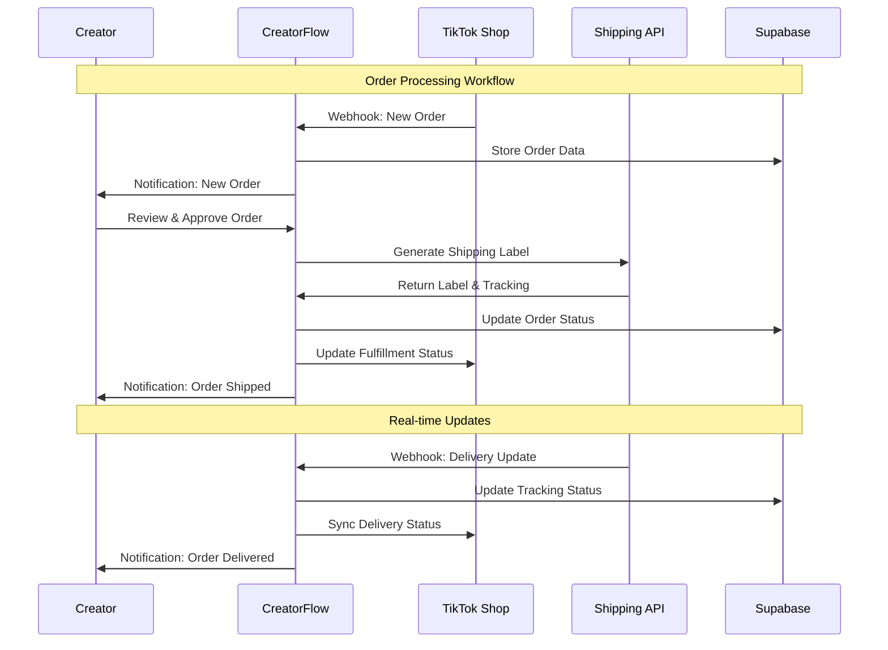

### Authentication & Authorization Flow

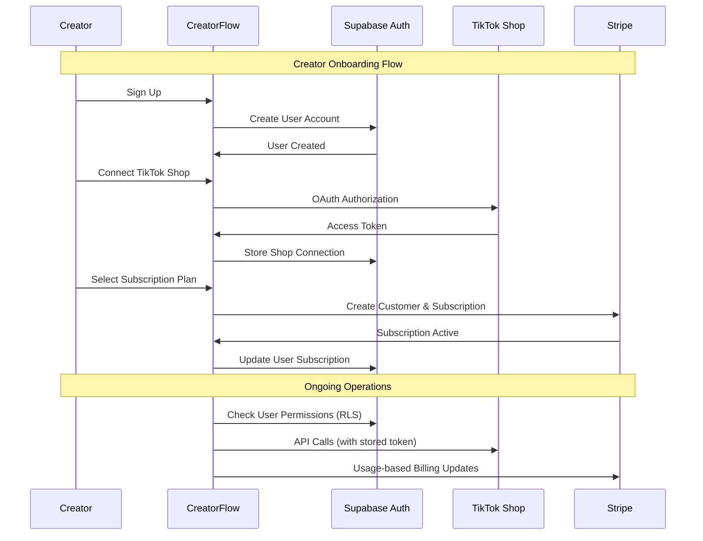

## 🗄️ Database Architecture

### Core Database Schema

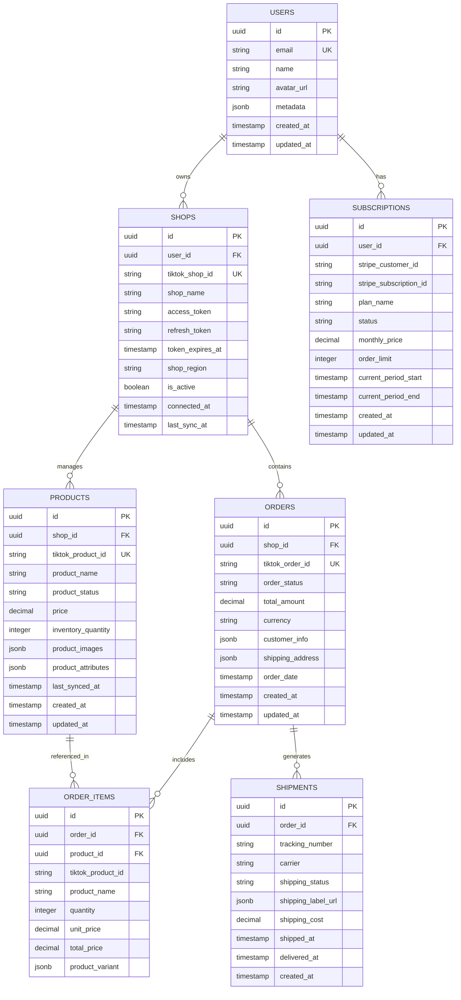

## 🔐 Security Architecture

### Security Layers

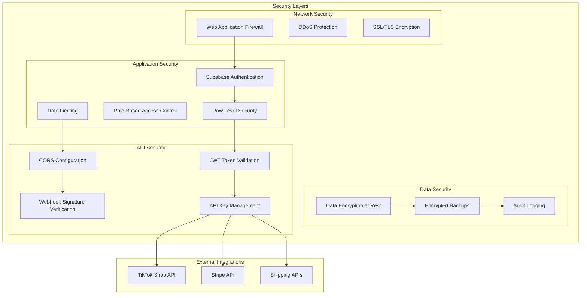

## 📊 Performance Architecture

### Caching Strategy

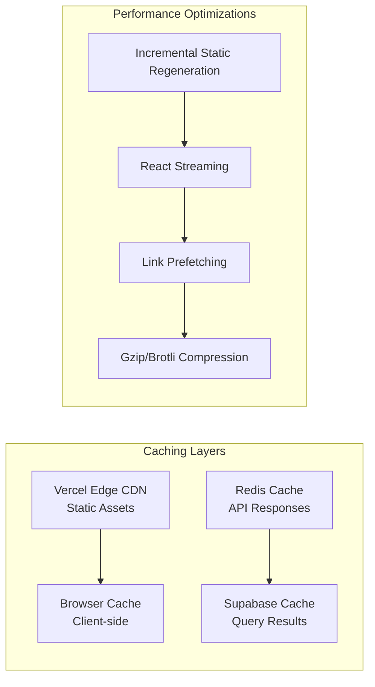

### Scalability Targets

| Metric | Target | Current | Strategy |
|--------|--------|---------|----------|
| **Orders/Day** | 500+ per creator | 50 | Horizontal scaling, caching |
| **API Response Time** | <200ms | <100ms | Edge deployment, Redis cache |
| **Database Queries** | <50ms | <30ms | Optimized indexes, connection pooling |
| **Webhook Processing** | <5s | <2s | Queue-based processing |
| **Concurrent Users** | 1000+ | 100 | Load balancing, CDN |

## 🚀 Deployment Architecture

### Multi-Environment Strategy

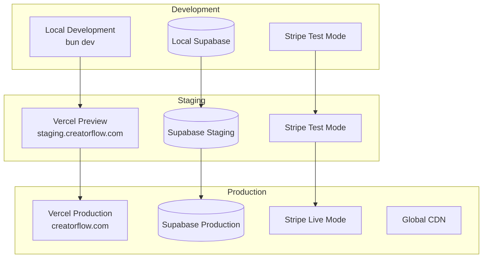

## 📈 Monitoring & Observability

### Monitoring Stack

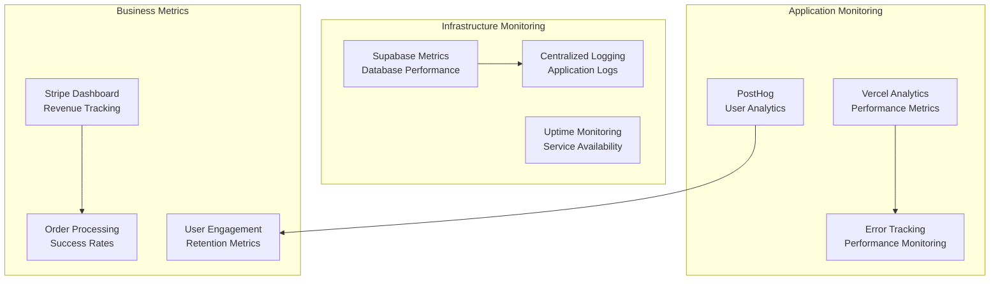

## 🔄 Integration Patterns

### API Integration Architecture

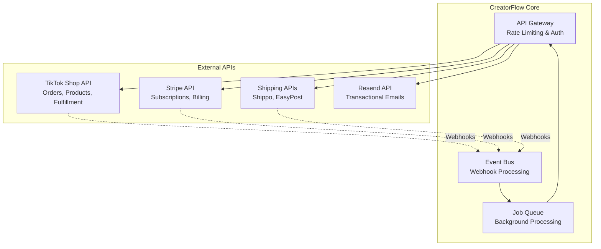

## Related Documentation

- [Development Guide](../development/README.md) - Setup and development workflow
- [Business Model](../business/README.md) - Business context and objectives
- [TikTok Shop Integration](../integrations/tiktok-shop/01-specifications/S001-DRAFT-api-integration-specifications.md) - API integration specs
- [Security Overview](../security/README.md) - Detailed security implementation
- [MoSCoW Roadmap](../development/moscow-methodology/02-implementation/I001-DRAFT-roadmap.md) - Implementation priorities

---

*This architecture supports CreatorFlow's mission to scale TikTok Shop creators from 50 to 500+ orders per day through automated fulfillment processes.*
    end

    subgraph "CreatorFlow Platform"
        WebApp[Next.js Web App]
        API[API Routes]
        Auth[Supabase Auth]
        DB[(PostgreSQL)]
        Queue[Job Queue]
    end

    subgraph "Infrastructure"
        CDN[Vercel Edge Network]
        Monitor[Monitoring & Logs]
        Backup[Automated Backups]
    end

    TikTok -->|Webhooks| API
    API -->|Process Orders| Queue
    Queue -->|Generate Labels| Shippo
    WebApp -->|User Interface| Auth
    API -->|Data Layer| DB
    Stripe -->|Billing Events| API
    CDN -->|Global Delivery| WebApp
```

## 🔧 Component Architecture

### Frontend Layer
```
┌─────────────────────────────────────┐
│           Next.js App Router        │
├─────────────────────────────────────┤
│  Pages & Layouts  │  API Routes     │
│  ├── Dashboard    │  ├── Webhooks   │
│  ├── Orders       │  ├── TikTok     │
│  ├── Analytics    │  ├── Shipping   │
│  └── Settings     │  └── Stripe     │
├─────────────────────────────────────┤
│         Component Library           │
│  ├── UI Components (shadcn/ui)      │
│  ├── Business Components           │
│  └── Layout Components             │
├─────────────────────────────────────┤
│         State Management            │
│  ├── React Query (Server State)    │
│  ├── Zustand (Client State)        │
│  └── Context API (Theme, Auth)     │
└─────────────────────────────────────┘
```

### Backend Layer
```
┌─────────────────────────────────────┐
│          API Layer                  │
├─────────────────────────────────────┤
│  Route Handlers  │  Middleware      │
│  ├── Orders      │  ├── Auth        │
│  ├── Webhooks    │  ├── CORS        │
│  ├── Analytics   │  ├── Rate Limit  │
│  └── Admin       │  └── Validation  │
├─────────────────────────────────────┤
│         Business Logic              │
│  ├── Order Processing              │
│  ├── Shipping Integration          │
│  ├── Payment Processing            │
│  └── Analytics Engine              │
├─────────────────────────────────────┤
│          Data Layer                 │
│  ├── Supabase Client               │
│  ├── Database Queries              │
│  ├── Real-time Subscriptions       │
│  └── File Storage                  │
└─────────────────────────────────────┘
```

## 🔄 Data Flow Architecture

### Order Processing Flow
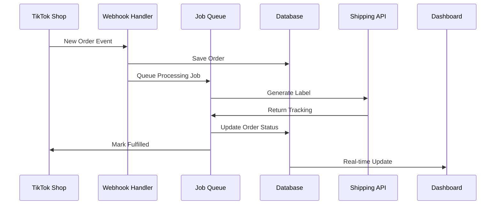

### User Authentication Flow
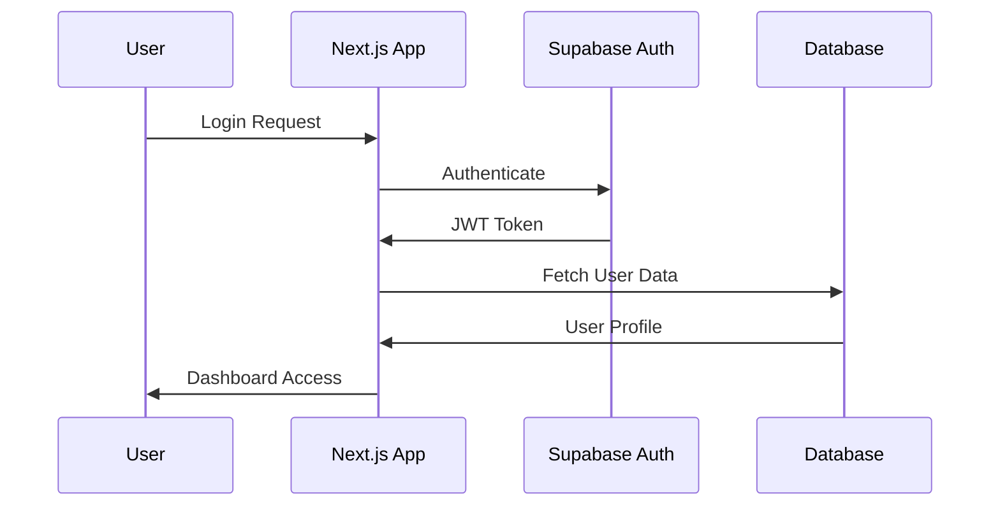

## 🗄️ Database Architecture

### Core Entities
```sql
-- Users and Authentication
users (id, email, created_at, subscription_status)
profiles (user_id, business_name, settings, preferences)

-- TikTok Shop Integration
tiktok_shops (id, user_id, shop_id, access_token, webhook_url)
products (id, shop_id, tiktok_product_id, name, sku, price)

-- Order Management
orders (id, shop_id, tiktok_order_id, status, total_amount, created_at)
order_items (id, order_id, product_id, quantity, price)

-- Shipping Integration
shipments (id, order_id, carrier, tracking_number, label_url, status)
shipping_addresses (id, order_id, name, address_line1, city, state, zip)

-- Analytics and Reporting
analytics_events (id, user_id, event_type, properties, timestamp)
revenue_metrics (id, user_id, date, orders_count, revenue, profit_margin)
```

### Relationships
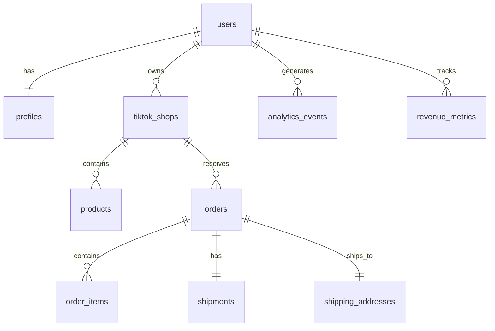

## 🔐 Security Architecture

### Authentication & Authorization
- **Supabase Auth**: JWT-based authentication with refresh tokens
- **Row Level Security (RLS)**: Database-level access control
- **API Key Management**: Secure storage of third-party API keys
- **Role-Based Access**: Admin, user, and read-only access levels

### Data Protection
- **Encryption at Rest**: AES-256 encryption for sensitive data
- **Encryption in Transit**: TLS 1.3 for all communications
- **PII Handling**: GDPR-compliant data processing
- **Audit Logging**: Comprehensive security event logging

### API Security
- **Rate Limiting**: Prevent abuse and DDoS attacks
- **Webhook Verification**: Cryptographic signature validation
- **CORS Configuration**: Strict origin validation
- **Input Validation**: Zod schemas for all inputs

## 📊 Performance Architecture

### Caching Strategy
```
┌─────────────────────────────────────┐
│            CDN Layer                │
│  ├── Static Assets (Vercel Edge)    │
│  ├── API Responses (Redis)          │
│  └── Database Queries (Supabase)    │
├─────────────────────────────────────┤
│         Application Layer           │
│  ├── React Query (Client Cache)     │
│  ├── Next.js ISR (Page Cache)       │
│  └── Service Worker (Offline)       │
├─────────────────────────────────────┤
│          Database Layer             │
│  ├── Connection Pooling             │
│  ├── Query Optimization             │
│  └── Read Replicas                  │
└─────────────────────────────────────┘
```

### Scalability Patterns
- **Horizontal Scaling**: Stateless API design for easy scaling
- **Database Optimization**: Proper indexing and query optimization
- **Async Processing**: Job queues for heavy operations
- **Edge Computing**: Global CDN for reduced latency

## 🚀 Deployment Architecture

### Development Environment
```
Developer Machine
├── Next.js Dev Server (localhost:3000)
├── Supabase Local (localhost:54321)
├── Stripe CLI (webhook forwarding)
└── ngrok (external webhook testing)
```

### Production Environment
```
Vercel/Fly.io
├── Next.js Application (Edge Functions)
├── Supabase Production (Global)
├── Stripe Live Mode (Webhooks)
└── Monitoring (PostHog, Sentry)
```

### CI/CD Pipeline
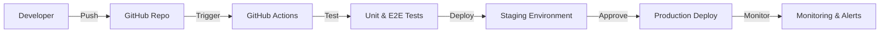

## 🔍 Monitoring & Observability

### Application Monitoring
- **Performance**: Core Web Vitals and API response times
- **Errors**: Real-time error tracking with Sentry
- **Usage**: User behavior analytics with PostHog
- **Business Metrics**: Order volume, revenue, and conversion rates

### Infrastructure Monitoring
- **Uptime**: Service availability monitoring
- **Database**: Query performance and connection health
- **API**: Rate limiting and webhook delivery status
- **Security**: Failed authentication attempts and suspicious activity

## 🔄 Integration Architecture

### TikTok Shop Integration
```typescript
interface TikTokShopIntegration {
  authentication: 'OAuth 2.0';
  webhooks: ['order.created', 'order.updated', 'order.cancelled'];
  apis: ['orders', 'products', 'fulfillment'];
  rateLimits: '1000 requests/minute';
}
```

### Shipping Provider Integration
```typescript
interface ShippingIntegration {
  providers: ['Shippo', 'EasyPost', 'ShipStation'];
  features: ['label_generation', 'tracking', 'rate_shopping'];
  webhooks: ['shipment.created', 'shipment.delivered'];
}
```

### Payment Processing
```typescript
interface StripeIntegration {
  products: ['subscriptions', 'one_time_payments'];
  webhooks: ['invoice.paid', 'subscription.updated'];
  features: ['customer_portal', 'usage_billing'];
}
```

## 📈 Scalability Considerations

### Current Capacity
- **Orders**: 10,000+ orders per day
- **Users**: 1,000+ concurrent users
- **API**: 100,000+ requests per hour
- **Database**: 1TB+ data storage

### Growth Planning
- **Horizontal Scaling**: Auto-scaling based on load
- **Database Sharding**: Partition by user or region
- **Microservices**: Split into domain-specific services
- **Global Deployment**: Multi-region deployment strategy

---

## 🔗 Related Documentation

- [Database Schema](database/README.md) - Detailed database design
- [API Design](api/README.md) - API endpoints and specifications
- [Security Architecture](security/README.md) - Security implementation details
- [Performance Optimization](performance/README.md) - Performance tuning guide

---

*This architecture documentation is maintained alongside code changes and reviewed quarterly for optimization opportunities.*
