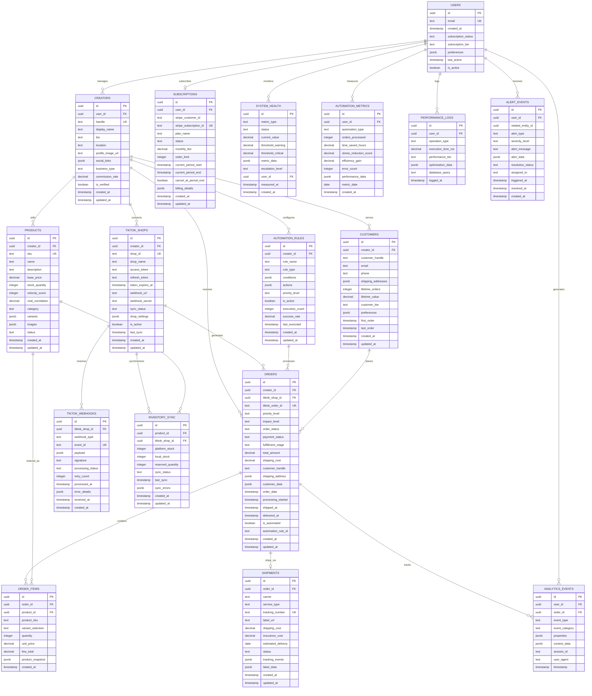

# CreatorFlow Comprehensive Entity Relationship Diagram

## Executive Summary

This document presents a complete Entity Relationship Diagram (ERD) for CreatorFlow, a TikTok Shop fulfillment automation platform. The ERD captures sophisticated UI interactions identified in mock components, real-time requirements, and Supabase-specific architectural patterns.

## Core Business Entities Analysis

### Identified Entities from UI Components

Based on analysis of mock components (`08MobileOrder.tsx`, `09DesktopOrderTableComponent.tsx`, `10DesktopDashboardCommandCenter.tsx`), the following entities emerge:

1. **Creator** - TikTok Shop sellers with handle-based identification
2. **Order** - Central fulfillment entity with priority/impact classification
3. **Product** - Inventory items with viral correlation tracking
4. **SystemHealth** - Real-time monitoring with escalation protocols
5. **AutomationMetric** - Time liberation and stress elimination tracking
6. **TikTokShopIntegration** - OAuth and webhook management

## Complete Entity Relationship Diagram



## Entity Specifications

### Core Business Entities

#### USERS
- **Primary Key**: `id` (UUID)
- **Unique Keys**: `email`
- **RLS Policy**: `auth.uid() = id`
- **Indexes**: `email`, `subscription_status`, `last_active`

#### CREATORS  
- **Primary Key**: `id` (UUID)
- **Foreign Keys**: `user_id` → USERS.id
- **Unique Keys**: `handle`
- **RLS Policy**: `auth.uid() IN (SELECT user_id FROM creators WHERE id = creator_id)`
- **Indexes**: `user_id`, `handle`, `is_verified`

#### ORDERS (Central Entity)
- **Primary Key**: `id` (UUID)  
- **Foreign Keys**: `creator_id` → CREATORS.id, `tiktok_shop_id` → TIKTOK_SHOPS.id
- **Unique Keys**: `tiktok_order_id`
- **Priority Levels**: `high`, `urgent`, `standard`, `automated`
- **Impact Levels**: `VIRAL`, `HIGH`, `MED`, `AUTO`
- **RLS Policy**: `auth.uid() IN (SELECT user_id FROM creators WHERE id = creator_id)`
- **Indexes**: 
  - `creator_id, order_status, created_at` (composite)
  - `priority_level, impact_level` (composite)
  - `tiktok_order_id`
  - `order_status`
  - `is_automated`

### Real-Time Monitoring Entities

#### SYSTEM_HEALTH
- **Purpose**: Real-time system monitoring with escalation
- **Status Values**: `nominal`, `warning`, `critical`
- **Escalation Levels**: `none`, `notify`, `alert`, `critical`
- **Real-time**: WebSocket updates for status changes

#### AUTOMATION_METRICS
- **Purpose**: Track time liberation and stress elimination
- **Metrics**: `time_saved_hours`, `stress_reduction_score`, `efficiency_gain`
- **Aggregation**: Daily, weekly, monthly rollups

## Row Level Security (RLS) Policies

### Creator Data Isolation
```sql
-- Standard creator access
CREATE POLICY "creators_own_data" ON creators
  FOR ALL USING (auth.uid() = user_id);

-- Orders access with creator relationship
CREATE POLICY "creators_own_orders" ON orders
  FOR ALL USING (
    auth.uid() IN (
      SELECT user_id FROM creators 
      WHERE id = orders.creator_id
    )
  );

-- Multi-shop access for enterprise creators
CREATE POLICY "creators_shop_orders" ON orders
  FOR ALL USING (
    auth.uid() IN (
      SELECT c.user_id FROM creators c
      JOIN tiktok_shops ts ON ts.creator_id = c.id
      WHERE ts.id = orders.tiktok_shop_id
    )
  );
```

### Real-Time Security
```sql
-- System health monitoring
CREATE POLICY "users_own_health_metrics" ON system_health
  FOR ALL USING (auth.uid() = user_id);

-- Analytics events
CREATE POLICY "users_own_analytics" ON analytics_events
  FOR ALL USING (auth.uid() = user_id);
```

## Performance Optimization Strategy

### Essential Indexes
```sql
-- High-traffic order queries
CREATE INDEX idx_orders_creator_status_date ON orders(creator_id, order_status, created_at);
CREATE INDEX idx_orders_priority_impact ON orders(priority_level, impact_level);
CREATE INDEX idx_orders_automated ON orders(is_automated) WHERE is_automated = true;

-- Real-time monitoring
CREATE INDEX idx_system_health_user_status ON system_health(user_id, status);
CREATE INDEX idx_analytics_user_timestamp ON analytics_events(user_id, timestamp);

-- TikTok Shop integration
CREATE INDEX idx_tiktok_shops_sync_status ON tiktok_shops(sync_status, last_sync);
CREATE INDEX idx_webhooks_processing ON tiktok_webhooks(processing_status, received_at);

-- Product velocity tracking
CREATE INDEX idx_products_velocity ON products(velocity_score DESC, viral_correlation DESC);
```

### Materialized Views
```sql
-- Creator dashboard metrics
CREATE MATERIALIZED VIEW creator_dashboard_metrics AS
SELECT 
  c.id as creator_id,
  c.handle,
  COUNT(o.id) as total_orders,
  COUNT(CASE WHEN o.created_at >= CURRENT_DATE - INTERVAL '30 days' THEN 1 END) as monthly_orders,
  COALESCE(SUM(o.total_amount), 0) as total_revenue,
  COALESCE(AVG(am.time_saved_hours), 0) as avg_time_saved,
  COALESCE(AVG(am.stress_reduction_score), 0) as avg_stress_reduction
FROM creators c
LEFT JOIN orders o ON c.id = o.creator_id
LEFT JOIN automation_metrics am ON c.user_id = am.user_id
GROUP BY c.id, c.handle;
```

## Real-Time Subscriptions

### WebSocket Configuration
```sql
-- Enable real-time for critical tables
ALTER PUBLICATION supabase_realtime ADD TABLE orders;
ALTER PUBLICATION supabase_realtime ADD TABLE system_health;
ALTER PUBLICATION supabase_realtime ADD TABLE automation_metrics;
ALTER PUBLICATION supabase_realtime ADD TABLE alert_events;
```

### Event Streaming Functions
```sql
-- Real-time order status updates
CREATE OR REPLACE FUNCTION notify_order_update()
RETURNS trigger AS $$
BEGIN
  PERFORM pg_notify(
    'order_updates',
    json_build_object(
      'order_id', NEW.id,
      'creator_id', NEW.creator_id,
      'status', NEW.order_status,
      'priority', NEW.priority_level,
      'impact', NEW.impact_level
    )::text
  );
  RETURN NEW;
END;
$$ LANGUAGE plpgsql;

CREATE TRIGGER order_update_notify
  AFTER INSERT OR UPDATE ON orders
  FOR EACH ROW EXECUTE FUNCTION notify_order_update();
```

## Edge Function Integration Points

### TikTok Shop Webhook Processing
- **Function**: `tiktok-shop-webhook`
- **Triggers**: TIKTOK_WEBHOOKS inserts
- **Actions**: Order sync, inventory updates, customer creation

### Automation Engine
- **Function**: `process-automation-rules`  
- **Triggers**: Order status changes
- **Actions**: Execute automation rules, update metrics

### System Health Monitoring
- **Function**: `health-check-monitor`
- **Schedule**: Every 5 minutes
- **Actions**: Update SYSTEM_HEALTH, trigger alerts

## Data Migration Considerations

### Schema Evolution Strategy
1. **Backward Compatibility**: Version all TikTok Shop API schemas
2. **Zero-Downtime**: Use database migrations with rollback support  
3. **Data Integrity**: Maintain referential integrity during schema changes
4. **Performance**: Test index performance with production data volumes

### Migration Safety Patterns
```sql
-- Add new columns with defaults
ALTER TABLE orders ADD COLUMN IF NOT EXISTS viral_score INTEGER DEFAULT 0;

-- Create indexes concurrently
CREATE INDEX CONCURRENTLY idx_orders_viral_score ON orders(viral_score DESC);

-- Update RLS policies atomically
BEGIN;
DROP POLICY IF EXISTS "creators_own_orders" ON orders;
CREATE POLICY "creators_own_orders_v2" ON orders FOR ALL USING (...);
COMMIT;
```

## Monitoring & Observability

### Health Check Functions
```sql
-- Database performance monitoring
CREATE OR REPLACE FUNCTION check_database_performance()
RETURNS TABLE (
  metric TEXT,
  current_value NUMERIC,
  threshold NUMERIC,
  status TEXT
) AS $$
BEGIN
  RETURN QUERY
  SELECT 
    'active_connections'::TEXT,
    (SELECT count(*) FROM pg_stat_activity WHERE state = 'active')::NUMERIC,
    100::NUMERIC,
    CASE WHEN (SELECT count(*) FROM pg_stat_activity WHERE state = 'active') < 100 
         THEN 'healthy' ELSE 'warning' END::TEXT;
END;
$$ LANGUAGE plpgsql;
```

### Query Performance Tracking
```sql
-- Slow query detection
CREATE OR REPLACE FUNCTION log_slow_queries()
RETURNS void AS $$
BEGIN
  INSERT INTO performance_logs (operation_type, execution_time_ms, database_query, logged_at)
  SELECT 
    'slow_query',
    total_time,
    query,
    NOW()
  FROM pg_stat_statements
  WHERE total_time > 1000 -- queries over 1 second
  AND calls > 10; -- with significant usage
END;
$$ LANGUAGE plpgsql;
```

## Security Architecture

### Data Encryption
- **Sensitive Fields**: `access_token`, `refresh_token` in TIKTOK_SHOPS
- **PII Protection**: Customer email, phone in CUSTOMERS
- **Audit Trails**: All financial transactions in ANALYTICS_EVENTS

### Access Control Matrix
| Role | Users | Creators | Orders | Products | System Health |
|------|-------|----------|---------|----------|---------------|
| Creator | Own | Own | Own | Own | Own |
| Support | Read | Read | Read | Read | All |
| Admin | All | All | All | All | All |

## Implementation Recommendations

### Phase 1: Core Entities (Must Have)
- USERS, CREATORS, ORDERS, ORDER_ITEMS
- Basic RLS policies and indexes
- Essential real-time subscriptions

### Phase 2: TikTok Integration (Should Have)  
- TIKTOK_SHOPS, TIKTOK_WEBHOOKS
- Webhook processing functions
- Order synchronization

### Phase 3: Advanced Features (Could Have)
- AUTOMATION_RULES, SYSTEM_HEALTH
- Performance monitoring
- Advanced analytics

### Phase 4: Enterprise Features (Won't Have Initially)
- Multi-tenant support
- Advanced reporting
- Third-party integrations

## Related Documents

- [Project Documentation Standards](/docs/development/documentation-standards/DOCUMENTATION_STANDARDS.md)
- [Supabase Database Context](/supabase/CLAUDE.md)
- [CreatorFlow Project Overview](/CLAUDE.md)
- [Database Specialist Agent Guidelines](/CLAUDE.md#database-specialist)

---

**Status**: DRAFT - Pending technical review and stakeholder approval
**Created**: 2025-01-07
**Last Updated**: 2025-01-07
**Version**: 1.0