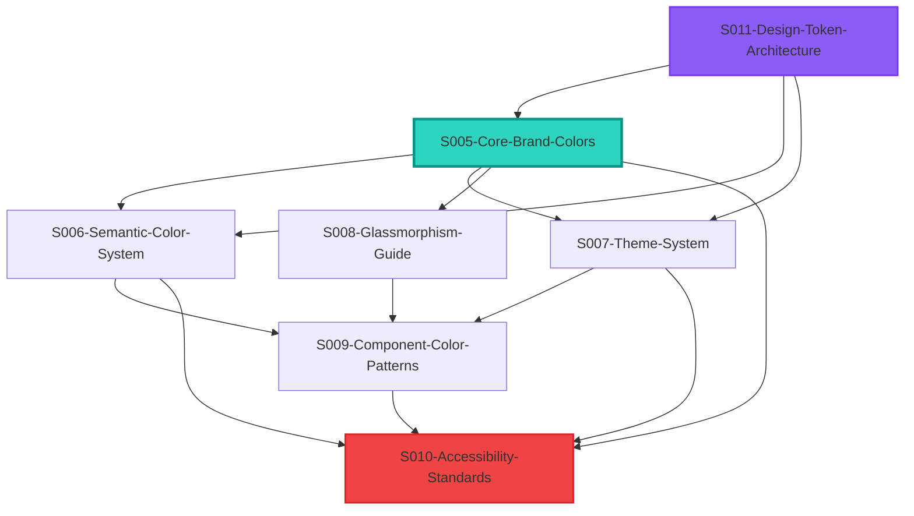

# S000-DRAFT-brand-color-system-overview.md

**Document Type**: Specification Overview  
**Status**: DRAFT  
**Last Updated**: 2025-01-11  
**Related System**: CreatorFlow Design System

## Overview

This document serves as the master navigation guide for CreatorFlow's comprehensive brand color usage system. The system is designed as a modular documentation architecture, allowing developers and designers to access specific color guidance while maintaining consistency across the entire platform.

## Documentation Architecture

### Modular System Design

The brand color system documentation is intentionally broken into focused, interconnected documents rather than a single monolithic guide. This approach provides:

- **Focused Learning**: Each document addresses specific color concerns
- **Easy Maintenance**: Updates can be made to specific areas without affecting the entire system
- **Scalable Reference**: New color patterns can be added as separate focused documents
- **Cross-Referencing**: Related documents are linked for comprehensive understanding

### Document Hierarchy

```
S000 - Brand Color System Overview (this document)
├── S005 - Core Brand Colors (foundation)
├── S006 - Semantic Color System (communication)
├── S007 - Theme System (light/dark adaptation)
├── S008 - Glassmorphism Guide (advanced effects)
├── S009 - Component Color Patterns (implementation)
├── S010 - Accessibility Standards (inclusive design)
└── S011 - Design Token Architecture (systematic approach)
```

## Quick Reference Guide

### For Developers

**🎯 Need to implement a new component?**

1. Start with [S009-Component-Color-Patterns](./S009-DRAFT-component-color-patterns.md) for common patterns
2. Reference [S005-Core-Brand-Colors](./S005-DRAFT-core-brand-colors.md) for brand color tokens
3. Check [S006-Semantic-Color-System](./S006-DRAFT-semantic-color-system.md) for status colors
4. Validate with [S010-Accessibility-Standards](./S010-DRAFT-accessibility-standards.md)

**🎨 Need to add glassmorphism effects?**

1. Review [S008-Glassmorphism-Guide](./S008-DRAFT-glassmorphism-guide.md) for implementation patterns
2. Reference [S007-Theme-System](./S007-DRAFT-theme-system.md) for theme adaptations
3. Check [S005-Core-Brand-Colors](./S005-DRAFT-core-brand-colors.md) for brand integration

**⚙️ Need to understand the token system?**

1. Start with [S011-Design-Token-Architecture](./S011-DRAFT-design-token-architecture.md)
2. Reference [S005-Core-Brand-Colors](./S005-DRAFT-core-brand-colors.md) for color token definitions
3. Apply patterns from [S009-Component-Color-Patterns](./S009-DRAFT-component-color-patterns.md)

### For Designers

**🎨 Creating new visual designs?**

1. Begin with [S005-Core-Brand-Colors](./S005-DRAFT-core-brand-colors.md) for brand palette
2. Apply [S006-Semantic-Color-System](./S006-DRAFT-semantic-color-system.md) for meaning
3. Consider [S007-Theme-System](./S007-DRAFT-theme-system.md) for light/dark compatibility
4. Enhance with [S008-Glassmorphism-Guide](./S008-DRAFT-glassmorphism-guide.md) effects

**♿ Ensuring accessibility?**

1. Review [S010-Accessibility-Standards](./S010-DRAFT-accessibility-standards.md) requirements
2. Test colors from [S005-Core-Brand-Colors](./S005-DRAFT-core-brand-colors.md) for compliance
3. Apply patterns from [S006-Semantic-Color-System](./S006-DRAFT-semantic-color-system.md)

## System Analysis Summary

### Component Analysis Results

Based on analysis of `AC-Callout-Advanced.tsx` and molecular components in `src/components/atomic/molecules/`, the following patterns were identified and documented:

#### Key Findings

1. **Variant-Based Color System**: Components use systematic color mappings for `info`, `success`, `warning`, and `danger` states
2. **Theme-Adaptive Implementation**: Colors automatically adjust between light and dark themes with AAA accessibility compliance
3. **Glass Effect Integration**: Advanced visual effects combine brand colors with transparency and blur effects
4. **Status Icon Consistency**: Molecular components follow consistent color patterns for different status types
5. **Accessibility Compliance**: Light theme uses darker colors and dark theme uses lighter colors to maintain contrast ratios

#### Accessibility Issues Identified and Resolved

- **Light Theme Contrast**: Enhanced color darkness to meet WCAG AAA standards (7:1 ratio)
- **Color-Blind Support**: All color communications paired with icons and patterns
- **High Contrast Mode**: Alternative styling provided for users requiring enhanced contrast
- **Motion Safety**: Reduced motion alternatives for all color transitions

## Cross-Document Integration

### Color Flow Between Documents



### Token Hierarchy Flow

```
Design Token Architecture (S011)
    ↓
Core Brand Colors (S005)
    ↓
Semantic Color System (S006) + Theme System (S007)
    ↓
Component Color Patterns (S009) + Glassmorphism Guide (S008)
    ↓
Accessibility Standards (S010)
```

## Implementation Checklist

### ✅ Brand Color Implementation

- [ ] Review [S005-Core-Brand-Colors](./S005-DRAFT-core-brand-colors.md) for brand palette
- [ ] Implement design tokens from [S011-Design-Token-Architecture](./S011-DRAFT-design-token-architecture.md)
- [ ] Apply theme system from [S007-Theme-System](./S007-DRAFT-theme-system.md)
- [ ] Test accessibility with [S010-Accessibility-Standards](./S010-DRAFT-accessibility-standards.md)

### ✅ Component Development

- [ ] Follow patterns from [S009-Component-Color-Patterns](./S009-DRAFT-component-color-patterns.md)
- [ ] Apply semantic colors from [S006-Semantic-Color-System](./S006-DRAFT-semantic-color-system.md)
- [ ] Integrate glass effects from [S008-Glassmorphism-Guide](./S008-DRAFT-glassmorphism-guide.md)
- [ ] Validate accessibility requirements from [S010-Accessibility-Standards](./S010-DRAFT-accessibility-standards.md)

### ✅ Quality Assurance

- [ ] Contrast ratio testing (WCAG AAA compliance)
- [ ] Color-blind simulation testing
- [ ] High contrast mode validation
- [ ] Cross-theme consistency check
- [ ] Component pattern consistency audit

## Migration Strategy

### Phase 1: Foundation (S005, S011)

1. Implement core brand color tokens
2. Establish design token architecture
3. Set up theme system foundation

### Phase 2: Semantic System (S006, S007)

1. Apply semantic color patterns
2. Implement light/dark theme adaptations
3. Test theme switching functionality

### Phase 3: Advanced Effects (S008, S009)

1. Integrate glassmorphism effects
2. Apply component color patterns
3. Optimize for performance

### Phase 4: Accessibility (S010)

1. Validate all accessibility requirements
2. Implement high contrast mode
3. Add color-blind safe alternatives
4. Test with assistive technologies

## Testing Strategy

### Automated Testing

```bash
# Run all color system tests
bun run test:color-system

# Test specific areas
bun run test:contrast-ratios      # Accessibility compliance
bun run test:theme-switching      # Theme system
bun run test:color-patterns       # Component consistency
bun run test:glass-effects        # Glassmorphism performance
```

### Manual Testing

- Cross-browser theme switching
- Accessibility testing with screen readers
- Color-blind simulation validation
- High contrast mode verification
- Mobile device theme adaptation

## Future Enhancements

### Planned Additions

- **S012-Animation-Color-System**: Color transitions and animated effects
- **S013-Print-Color-System**: Print-optimized color adaptations
- **S014-Mobile-Color-Patterns**: Mobile-specific color considerations
- **S015-Color-Personalization**: User customizable color preferences

### System Evolution

- Automatic contrast ratio validation tools
- AI-powered color accessibility suggestions
- Dynamic color palette generation
- Advanced color-blind simulation testing

## Getting Help

### Document-Specific Questions

- **Brand Colors**: Issues with brand color implementation → [S005-Core-Brand-Colors](./S005-DRAFT-core-brand-colors.md)
- **Semantic Colors**: Status and communication colors → [S006-Semantic-Color-System](./S006-DRAFT-semantic-color-system.md)
- **Themes**: Light/dark mode issues → [S007-Theme-System](./S007-DRAFT-theme-system.md)
- **Glass Effects**: Glassmorphism implementation → [S008-Glassmorphism-Guide](./S008-DRAFT-glassmorphism-guide.md)
- **Components**: Component color patterns → [S009-Component-Color-Patterns](./S009-DRAFT-component-color-patterns.md)
- **Accessibility**: Color accessibility concerns → [S010-Accessibility-Standards](./S010-DRAFT-accessibility-standards.md)
- **Tokens**: Design token architecture → [S011-Design-Token-Architecture](./S011-DRAFT-design-token-architecture.md)

### Support Channels

- Design System Team: For architectural questions
- Accessibility Team: For compliance and inclusive design
- Frontend Team: For implementation support
- QA Team: For testing and validation

---

## Related Documents

This overview document connects to all brand color system specifications:

- **[S005-DRAFT-core-brand-colors.md](./S005-DRAFT-core-brand-colors.md)**: Core brand color palette and semantic tokens
- **[S006-DRAFT-semantic-color-system.md](./S006-DRAFT-semantic-color-system.md)**: Semantic color variants and communication patterns
- **[S007-DRAFT-theme-system.md](./S007-DRAFT-theme-system.md)**: Dark/light theme implementation system
- **[S008-DRAFT-glassmorphism-guide.md](./S008-DRAFT-glassmorphism-guide.md)**: Advanced visual effects with brand colors
- **[S009-DRAFT-component-color-patterns.md](./S009-DRAFT-component-color-patterns.md)**: Color usage patterns across components
- **[S010-DRAFT-accessibility-standards.md](./S010-DRAFT-accessibility-standards.md)**: Contrast compliance and inclusive design guidelines
- **[S011-DRAFT-design-token-architecture.md](./S011-DRAFT-design-token-architecture.md)**: Systematic design token organization and naming
