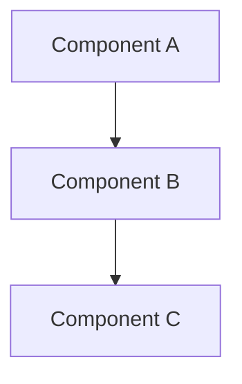
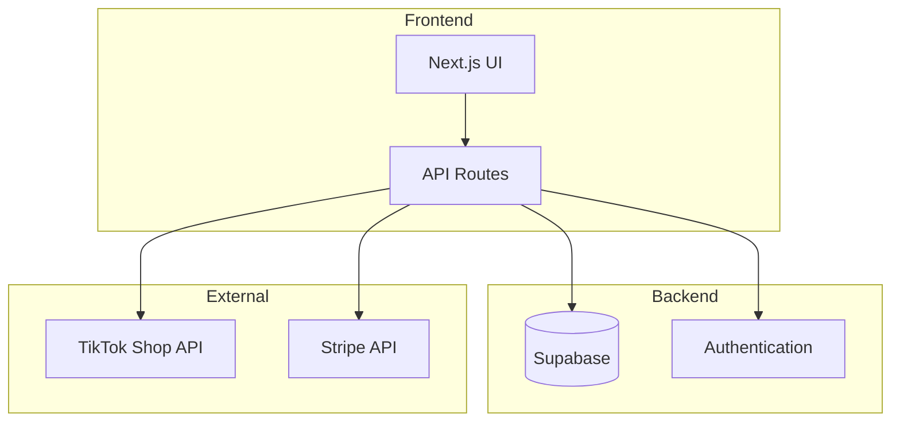
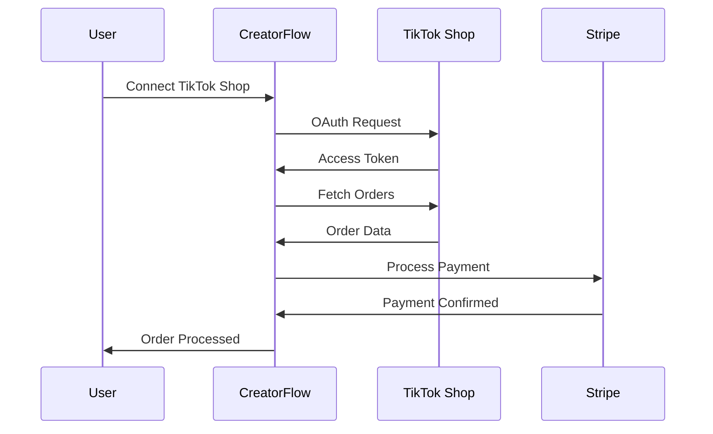
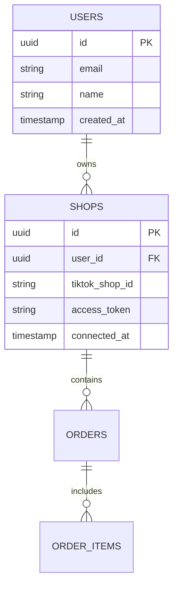

# Project Documentation Standards

## Overview

This document defines the official documentation standards for CreatorFlow, ensuring consistent, maintainable, and discoverable documentation across the entire project. All documentation must follow these standards and the **MoSCoW agile methodology**.

## Documentation Architecture

### Four-Category Structure

All documentation initiatives must follow this structure:

```
docs/development/[initiative-name]/
├── 00-planning/          # Investigation and planning documents
├── 01-specifications/    # Technical requirements and specs
├── 02-implementation/    # Implementation progress and guides
└── 03-reports/          # Final reports and retrospectives
```

### File Naming Convention

| Category | Prefix | Format | Example |
|----------|--------|--------|---------|
| Planning | P### | `P001-initiative-investigation.md` | `P001-tiktok-shop-investigation.md` |
| Specifications | S### | `S001-technical-requirements.md` | `S001-api-integration-specs.md` |
| Implementation | I### | `I001-DRAFT-implementation-progress.md` | `I001-DRAFT-api-integration-progress.md` |
| Reports | R### | `R001-DRAFT-final-report.md` | `R001-DRAFT-integration-report.md` |

## MoSCoW Methodology Integration

### Mandatory MoSCoW Application

All documentation must include MoSCoW prioritization:

#### **Must Have (M)** - Critical Requirements
- Core TikTok Shop integration (Product, Order, Fulfillment APIs)
- User authentication and security
- Basic order processing workflow
- Payment processing with Stripe

#### **Should Have (S)** - Important Features
- Advanced analytics dashboard
- Multi-carrier shipping integration
- Automated notifications
- Bulk operations

#### **Could Have (C)** - Nice-to-Have Features
- AI-powered forecasting
- Multi-language support
- Advanced reporting
- Third-party integrations

#### **Won't Have (W)** - Out of Scope
- Full e-commerce platform
- Social media content tools
- Accounting features
- Manufacturing tools

### Documentation MoSCoW Template

```markdown
## MoSCoW Prioritization

### Must Have (M)
- [ ] Critical requirement 1
- [ ] Critical requirement 2

### Should Have (S)
- [ ] Important feature 1
- [ ] Important feature 2

### Could Have (C)
- [ ] Nice-to-have feature 1
- [ ] Nice-to-have feature 2

### Won't Have (W)
- [ ] Out of scope item 1
- [ ] Out of scope item 2
```

## Document Templates

### Planning Document Template

```markdown
# P###: [Initiative Name] Investigation

**Document Type**: Planning  
**Status**: DRAFT  
**Priority**: Must Have (M) | Should Have (S) | Could Have (C) | Won't Have (W)  
**Created**: YYYY-MM-DD  
**Last Updated**: YYYY-MM-DD  

## Executive Summary
Brief overview of the investigation and key findings.

## Business Context
- Problem statement
- Business objectives
- Success criteria

## Technical Investigation
- Current state analysis
- Technical requirements
- Integration points

## MoSCoW Prioritization
[Use template above]

## Recommendations
- Proposed approach
- Implementation timeline
- Resource requirements

## Next Steps
- [ ] Action item 1
- [ ] Action item 2

## Related Documentation
- [Specifications: Technical Requirements](../01-specifications/S001-technical-requirements.md)
- [Implementation: Progress Tracking](../02-implementation/I001-DRAFT-implementation-progress.md)
```

### Specifications Document Template

```markdown
# S###: [Feature Name] Technical Specifications

**Document Type**: Specifications  
**Status**: APPROVED | DRAFT  
**Priority**: Must Have (M) | Should Have (S) | Could Have (C) | Won't Have (W)  
**Created**: YYYY-MM-DD  
**Last Updated**: YYYY-MM-DD  

## Overview
Technical specifications for the feature implementation.

## Requirements

### Functional Requirements
- Requirement 1
- Requirement 2

### Non-Functional Requirements
- Performance requirements
- Security requirements
- Scalability requirements

## Technical Architecture



## API Specifications
- Endpoint definitions
- Request/response formats
- Error handling

## Database Schema
- Table definitions
- Relationships
- Indexes

## Security Considerations
- Authentication requirements
- Authorization rules
- Data protection

## Testing Strategy
- Unit testing approach
- Integration testing
- E2E testing scenarios

## Acceptance Criteria
- [ ] Criterion 1
- [ ] Criterion 2

## Related Documentation
- [Planning: Investigation](../00-planning/P001-investigation.md)
- [Implementation: Progress](../02-implementation/I001-DRAFT-implementation-progress.md)
```

## Diagram Standards

### Mermaid Diagrams

Use Mermaid for all technical diagrams:

#### System Architecture


#### Data Flow


#### Database Schema


## Quality Gates

### Documentation Review Checklist

- [ ] **Follows Documentation Standards**: Uses proper structure and naming
- [ ] **MoSCoW Prioritization**: Includes proper prioritization
- [ ] **Technical Accuracy**: Information is correct and up-to-date
- [ ] **Completeness**: All required sections are present
- [ ] **Clarity**: Content is clear and understandable
- [ ] **Diagrams**: Includes relevant technical diagrams
- [ ] **Links**: All internal links work correctly
- [ ] **DRAFT Status**: Implementation docs use DRAFT prefix until approved

### Approval Process

1. **Creation**: Author creates document with DRAFT prefix
2. **Review**: Technical review by team members
3. **Validation**: User acceptance testing (for implementation docs)
4. **Approval**: Remove DRAFT prefix after validation
5. **Maintenance**: Regular updates and reviews

## Prohibited Practices

❌ **Never Do**:
- Create documentation in project root
- Claim implementation is "COMPLETE" without validation
- Skip MoSCoW prioritization
- Use inconsistent naming conventions
- Create final reports before user testing

✅ **Always Do**:
- Use four-category structure
- Include MoSCoW prioritization
- Add relevant diagrams
- Link to related documentation
- Wait for validation before removing DRAFT prefix

## Related Documentation

- [MoSCoW Implementation Roadmap](../moscow-methodology/02-implementation/I001-DRAFT-roadmap.md) - Single source of truth
- [Development Guide](../README.md) - Development setup and guidelines
- [Architecture Overview](../../architecture/README.md) - System architecture
- [Business Model](../../business/README.md) - Business context and objectives

---

*This document serves as the foundation for all CreatorFlow documentation and ensures consistency across the entire project.*
