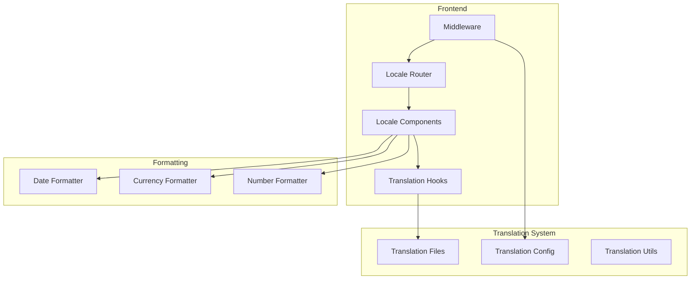

# S001: Internationalization Technical Specifications

**Document Type**: Specifications  
**Status**: DRAFT  
**Priority**: Could Have (C)  
**Created**: 2025-01-04  
**Last Updated**: 2025-01-04  

## Overview

Technical specifications for implementing multi-language support using `next-intl` library with Next.js 15 App Router architecture.

## Requirements

### Functional Requirements
- Locale-based routing with `/[locale]` pattern
- Translation key management system
- Language switcher component
- Cultural formatting (dates, currency, numbers)

### Non-Functional Requirements
- Page load time < 2s for all locales
- Bundle size increase < 20%
- SEO compatibility with hreflang
- Static generation support

## Technical Architecture



## Implementation Specifications

### File Structure
```
src/
├── app/[locale]/
│   ├── layout.tsx
│   ├── page.tsx
│   └── (dashboard)/
├── components/ui/
│   └── language-switcher.tsx
├── lib/i18n/
│   ├── config.ts
│   └── utils.ts
└── messages/
    ├── en.json
    ├── pt-br.json
    └── es.json
```

### Core Configuration
```typescript
// lib/i18n/config.ts
export const locales = ['en', 'pt-br', 'es'] as const;
export const defaultLocale = 'en' as const;
export type Locale = typeof locales[number];
```

### Middleware Setup
```typescript
// middleware.ts
import createMiddleware from 'next-intl/middleware';
import { locales, defaultLocale } from './lib/i18n/config';

export default createMiddleware({
  locales,
  defaultLocale,
  localePrefix: 'always'
});
```

## Translation Key Structure

### Naming Convention
```json
{
  "navigation": {
    "dashboard": "Dashboard",
    "orders": "Orders"
  },
  "forms": {
    "labels": {
      "email": "Email"
    },
    "validation": {
      "required": "This field is required"
    }
  }
}
```

## Acceptance Criteria

- [ ] All UI text uses translation keys
- [ ] Language switcher works correctly
- [ ] URLs include locale prefix
- [ ] Date/currency formatting per locale
- [ ] Static generation for all locales

## Related Documentation
- [Planning: Investigation](../00-planning/P001-internationalization-investigation.md)
- [Implementation: Progress](../02-implementation/I001-DRAFT-implementation-progress.md)