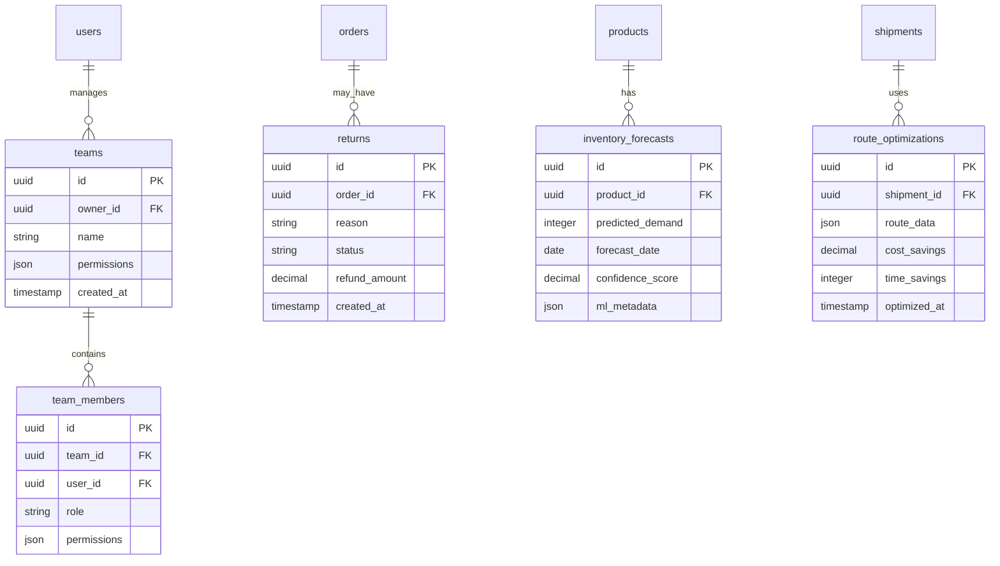

# S001: CreatorFlow Architecture Diagrams (MoSCoW Implementation)

## 🏗️ Overview

This document provides comprehensive architecture diagrams organized by MoSCoW priorities, showing the technical implementation roadmap for CreatorFlow's TikTok Shop fulfillment automation platform.

## 🎯 Must Have Architecture (MVP)

### Core System Architecture

### MVP Database Schema

---

## 🚀 Should Have Architecture (Growth Features)

### Enhanced System Architecture

### Enhanced Data Model

---

## 🌟 Could Have Architecture (Enhancement Features)

### Advanced Platform Architecture

### Advanced Data Architecture

---

## 🚫 Won't Have Architecture (Future Scope)

### Excluded Features Architecture

---

## 🔄 Implementation Phases

### Phase 1: Must Have (Weeks 1-12)

### Phase 2: Should Have (Weeks 13-24)

---

## 📊 Architecture Decision Records (ADRs)

### ADR-001: Database Choice
- **Decision**: PostgreSQL via Supabase
- **Rationale**: ACID compliance, JSON support, built-in auth
- **MoSCoW**: Must Have
- **Impact**: Foundation for all data operations

### ADR-002: API Architecture
- **Decision**: Next.js API Routes with tRPC
- **Rationale**: Type safety, performance, developer experience
- **MoSCoW**: Must Have
- **Impact**: Core platform communication

### ADR-003: Queue System
- **Decision**: Redis + Bull for job processing
- **Rationale**: Reliability, scalability, monitoring
- **MoSCoW**: Should Have
- **Impact**: Async processing capabilities

### ADR-004: Multi-Platform Strategy
- **Decision**: Plugin architecture for platform integrations
- **Rationale**: Extensibility, maintainability
- **MoSCoW**: Could Have
- **Impact**: Future platform expansion

---

## 🔗 Related Documentation

- [Epic Breakdown](S002-epic-breakdown.md) - Feature epics by MoSCoW category
- [Technical Specifications](S003-technical-specifications.md) - Detailed implementation specs
- [Implementation Roadmap](../02-implementation/I001-DRAFT-roadmap.md) - Development timeline

---

*These architecture diagrams guide the technical implementation based on MoSCoW prioritization and will be updated as requirements evolve.*
