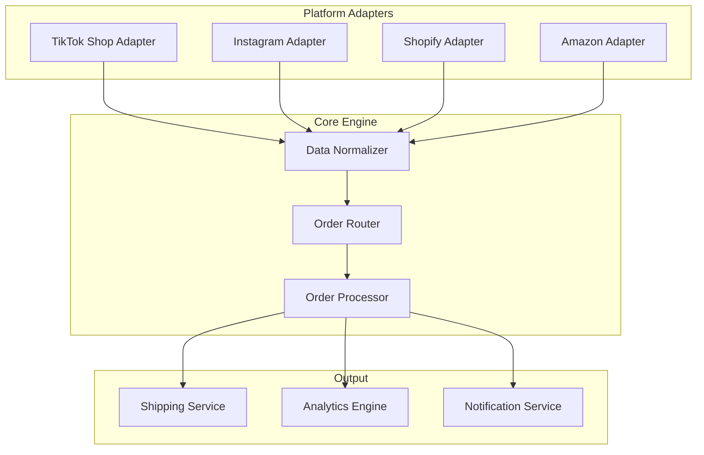

# S002: CreatorFlow Epic Breakdown (MoSCoW Methodology)

## 🎯 Overview

This document breaks down CreatorFlow's development into manageable epics organized by MoSCoW priorities, providing clear scope and acceptance criteria for each major feature area.

## 🔴 MUST HAVE Epics (MVP - Critical Path)

### Epic 1: TikTok Shop Integration Foundation
**Priority**: Must Have | **Effort**: 5 weeks | **Business Value**: Critical

#### User Stories
- As a TikTok Shop seller, I want to connect my shop via OAuth so that CreatorFlow can access my orders
- As a user, I want automatic order sync so that I don't have to manually enter order data
- As a system, I need webhook verification so that only legitimate TikTok requests are processed

#### Acceptance Criteria
- [ ] OAuth 2.0 flow with TikTok Shop API
- [ ] Secure token storage and refresh mechanism
- [ ] Webhook endpoint with signature verification
- [ ] Order data parsing and validation
- [ ] Error handling for API failures
- [ ] Rate limiting compliance (1000 req/min)

#### Technical Requirements

#### Definition of Done
- OAuth flow tested with real TikTok Shop account
- Webhook receives and processes test orders
- Error scenarios handled gracefully
- Security audit passed
- Documentation complete

---

### Epic 2: Core Order Processing Engine
**Priority**: Must Have | **Effort**: 4 weeks | **Business Value**: Critical

#### User Stories
- As a seller, I want orders automatically processed so that I can focus on other business tasks
- As a customer, I want my order fulfilled quickly so that I receive my products on time
- As a system, I need reliable order state management so that no orders are lost or duplicated

#### Acceptance Criteria
- [ ] Order ingestion from TikTok webhooks
- [ ] Order validation and data normalization
- [ ] Status tracking (pending → processing → shipped → delivered)
- [ ] Duplicate order detection
- [ ] Failed order retry mechanism
- [ ] Order history and audit trail

#### State Machine Diagram

#### Technical Components
- Order ingestion service
- Validation engine with Zod schemas
- State machine implementation
- Retry mechanism with exponential backoff
- Audit logging system

---

### Epic 3: Basic Shipping Integration
**Priority**: Must Have | **Effort**: 3 weeks | **Business Value**: High

#### User Stories
- As a seller, I want shipping labels automatically generated so that I can print and ship quickly
- As a seller, I want tracking numbers automatically updated so that customers can track their orders
- As a system, I need reliable shipping API integration so that label generation doesn't fail

#### Acceptance Criteria
- [ ] Shippo API integration for label generation
- [ ] Address validation and normalization
- [ ] Package weight and dimension handling
- [ ] Tracking number capture and storage
- [ ] Label URL generation and storage
- [ ] Shipping cost calculation

#### Integration Flow

#### Technical Requirements
- Shippo SDK integration
- Address validation service
- Error handling and fallback mechanisms
- Webhook handling for tracking updates
- Cost tracking and reporting

---

### Epic 4: User Authentication & Dashboard
**Priority**: Must Have | **Effort**: 3 weeks | **Business Value**: High

#### User Stories
- As a new user, I want to sign up easily so that I can start using the platform quickly
- As a returning user, I want secure login so that my data is protected
- As a user, I want a dashboard to see my orders so that I can monitor my business

#### Acceptance Criteria
- [ ] Supabase Auth integration with magic links
- [ ] User profile management
- [ ] Basic dashboard with order overview
- [ ] Order list with filtering and search
- [ ] Order detail view with tracking info
- [ ] Responsive design for mobile/desktop

#### Dashboard Wireframe

#### Key Components
- Authentication flow with magic links
- Protected route middleware
- Dashboard layout with navigation
- Order statistics and charts
- Responsive table component
- Real-time updates via Supabase subscriptions

---

### Epic 5: Subscription & Billing Foundation
**Priority**: Must Have | **Effort**: 2 weeks | **Business Value**: Critical

#### User Stories
- As a user, I want to subscribe to a plan so that I can access the platform features
- As a business, I want recurring revenue so that the platform is financially sustainable
- As a user, I want to manage my subscription so that I can upgrade or cancel as needed

#### Acceptance Criteria
- [ ] Stripe integration for subscription management
- [ ] Three pricing tiers (Starter, Growth, Scale)
- [ ] Usage-based billing for order volume
- [ ] Customer portal for subscription management
- [ ] Webhook handling for billing events
- [ ] Trial period and cancellation handling

#### Subscription Flow

#### Pricing Tiers
- **Starter**: $49/month - Up to 100 orders
- **Growth**: $99/month - Up to 500 orders  
- **Scale**: $199/month - Unlimited orders

---

## 🟡 SHOULD HAVE Epics (Growth Features)

### Epic 6: Multi-Carrier Shipping
**Priority**: Should Have | **Effort**: 4 weeks | **Business Value**: High

#### User Stories
- As a seller, I want multiple shipping options so that I can choose the best rates
- As a seller, I want automatic rate comparison so that I save money on shipping
- As a system, I need carrier redundancy so that shipping doesn't fail if one carrier is down

#### Acceptance Criteria
- [ ] EasyPost API integration
- [ ] ShipStation API integration
- [ ] Rate shopping engine
- [ ] Carrier preference settings
- [ ] Service level selection (ground, express, overnight)
- [ ] Carrier performance tracking

#### Rate Shopping Algorithm

---

### Epic 7: Advanced Analytics Dashboard
**Priority**: Should Have | **Effort**: 5 weeks | **Business Value**: Medium

#### User Stories
- As a seller, I want detailed analytics so that I can understand my business performance
- As a seller, I want shipping cost analysis so that I can optimize my margins
- As a seller, I want customer insights so that I can improve my service

#### Key Metrics
- Order volume trends
- Revenue and profit analysis
- Shipping cost breakdown
- Carrier performance comparison
- Customer repeat rate
- Geographic distribution

#### Analytics Architecture

---

### Epic 8: Bulk Operations & Automation
**Priority**: Should Have | **Effort**: 3 weeks | **Business Value**: High

#### User Stories
- As a seller with high volume, I want to process multiple orders at once so that I save time
- As a seller, I want automated rules so that orders are processed without my intervention
- As a seller, I want batch printing so that I can print multiple labels efficiently

#### Features
- Bulk order selection and processing
- Batch label generation and printing
- Automated processing rules
- Scheduled processing windows
- Bulk status updates
- Mass order cancellation

---

## 🟢 COULD HAVE Epics (Enhancement Features)

### Epic 9: Multi-Platform Integration
**Priority**: Could Have | **Effort**: 8 weeks | **Business Value**: Medium

#### Platforms
- Instagram Shopping
- Shopify stores
- Amazon FBA
- Etsy marketplace

#### Integration Strategy

---

### Epic 10: AI-Powered Features
**Priority**: Could Have | **Effort**: 6 weeks | **Business Value**: Low

#### Features
- Inventory demand forecasting
- Fraud detection
- Dynamic pricing optimization
- Customer lifetime value prediction

---

## 🔴 WON'T HAVE Epics (Future Roadmap)

### Epic 11: International Expansion
**Rationale**: Complex customs, regulations, and compliance requirements
**Future Consideration**: After domestic market saturation

### Epic 12: Manufacturing Integration
**Rationale**: Requires deep supply chain partnerships
**Future Consideration**: When reaching enterprise scale

### Epic 13: Blockchain Integration
**Rationale**: Limited market demand and technical complexity
**Future Consideration**: If market adoption increases significantly

---

## 📊 Epic Prioritization Matrix

| Epic | Business Value | Technical Complexity | Market Demand | Priority Score |
|------|----------------|---------------------|---------------|----------------|
| TikTok Integration | 10 | 7 | 10 | 9.0 |
| Order Processing | 10 | 6 | 10 | 8.7 |
| Shipping Integration | 9 | 5 | 9 | 7.7 |
| Auth & Dashboard | 8 | 4 | 8 | 6.7 |
| Billing Foundation | 9 | 5 | 7 | 7.0 |
| Multi-Carrier | 7 | 6 | 8 | 7.0 |
| Analytics | 6 | 7 | 7 | 6.7 |
| Bulk Operations | 8 | 5 | 8 | 7.0 |
| Multi-Platform | 8 | 9 | 6 | 7.7 |
| AI Features | 5 | 9 | 4 | 6.0 |

## 🎯 Success Metrics by Epic

### Must Have Success Metrics
- **TikTok Integration**: 100% webhook processing success rate
- **Order Processing**: <30 second average processing time
- **Shipping**: 95% successful label generation rate
- **Dashboard**: <2 second page load time
- **Billing**: 99% payment processing success rate

### Should Have Success Metrics
- **Multi-Carrier**: 15% average shipping cost reduction
- **Analytics**: 80% user engagement with dashboard
- **Bulk Operations**: 70% time savings for high-volume users

### Could Have Success Metrics
- **Multi-Platform**: 40% user adoption rate
- **AI Features**: 20% improvement in relevant KPIs

---

## 🔄 Epic Dependencies

---

*This epic breakdown provides the foundation for sprint planning and development execution, ensuring clear scope and measurable outcomes for each major feature area.*
