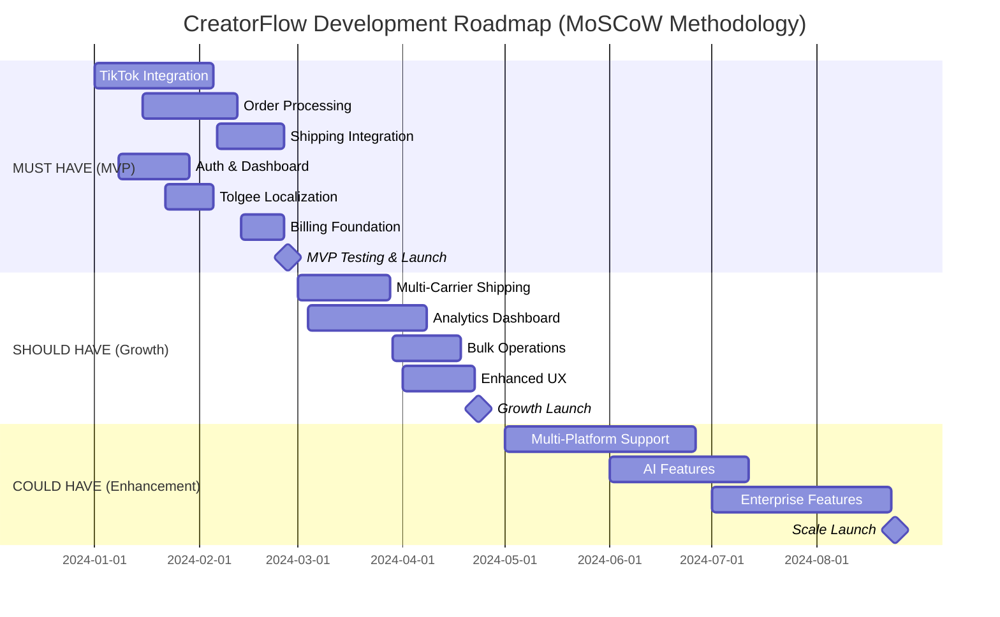
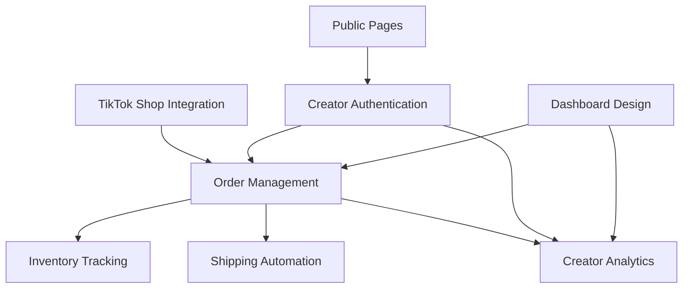
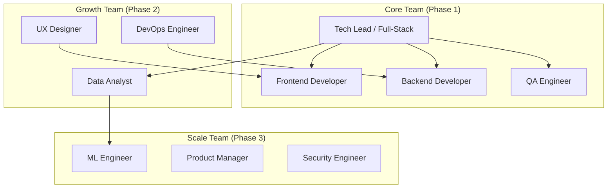
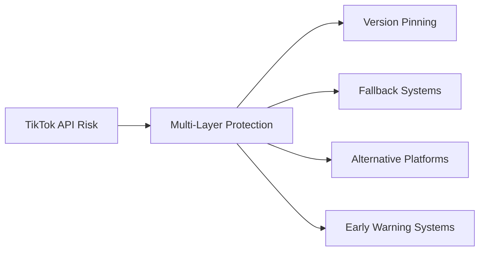

# I001: CreatorFlow Master Implementation Plan (Single Source of Truth)

## 🎯 Executive Summary

This document serves as the **single source of truth** for CreatorFlow's implementation, consolidating comprehensive analysis of 21+ systems and 85+ detailed documents into a cohesive roadmap. Based on systematic review of the five identified core areas (Core Systems, User Dashboard, Admin Dashboard, Public Pages, Localization System), this plan uses MoSCoW methodology to achieve $10M ARR within 24 months.

**Foundation**: Built on enterprise-grade capabilities from QuoteKit (billing, analytics, Edge Functions) and CDH (premium UI/UX) to create a platform that scales TikTok Shop creators from 50 to 500+ orders per day.

## 📋 Five Core Areas Implementation Analysis

Based on systematic review of all documentation in `docs/development/`, this roadmap consolidates findings from:

### **🎯 Core Systems (4 Systems)**
- **Order Management** (Planning Complete) - Central orchestrator specs defined, implementation NOT STARTED
- **TikTok Inventory Tracking** (Specifications Complete) - Comprehensive docs, implementation IN PROGRESS  
- **Shipping Automation** (Planning Only) - Multi-carrier investigation, no specifications yet
- **TikTok Shop Integration** (Planning Complete) - API specs defined, implementation NOT STARTED

### **👤 User Dashboard (2 Systems)**  
- **Dashboard Design** (Specifications Complete) - CDH manifesto UI specs, component library IN PROGRESS
- **Creator Analytics** (Planning Complete) - Business intelligence specs, implementation NOT STARTED

### **🔧 Admin Dashboard (2 Systems)**
- **Creator Authentication** (Planning Complete) - Security foundation specs, implementation NOT STARTED
- **MoSCoW Methodology** (Complete) - Planning framework and prioritization

### **🌐 Public Pages (1 System)**
- **Public Pages** (Specifications Complete) - MVPBlocks strategy defined, implementation IN PROGRESS

### **🌍 Localization System (1 System) - MUST HAVE**
- **Localization Automation** (Must Have - Phase 1) - Tolgee Platform + next-intl hybrid strategy, 47 opportunities identified, implementation READY

**Total Documentation**: 21 initiatives, 85+ documents, comprehensive specifications

## 📅 Implementation Timeline Overview

## 🔴 Phase 1: MUST HAVE Implementation (Weeks 1-12)

### **🎯 Core Systems Foundation**

#### Sprint 1-2: Order Management System (Production Ready)
**Business Impact**: $27,000/month savings per creator through automation
- [ ] **Order Engine**: State machine, validation, processing, audit trail
- [ ] **Workflow Engine**: Rules engine, triggers, conditions, actions  
- [ ] **Status Management**: Real-time sync, updates, tracking, history
- [ ] **Integration Layer**: TikTok Shop ◄─► Inventory ◄─► Shipping ◄─► Analytics

**Performance Targets**:
- 500+ orders/day per creator processing capacity
- <30 seconds order-to-fulfillment initiation
- 99.9% order processing accuracy
- 99.95% system availability

#### Sprint 3-4: TikTok Inventory Tracking (Production Ready)  
**Business Impact**: $8,400/month savings from preventing oversells
- [ ] **Sync Service**: Real-time inventory synchronization with <5 second latency
- [ ] **Alert Engine**: Low stock alerts with configurable thresholds
- [ ] **Transaction Manager**: Complete audit trail and transaction logging
- [ ] **Multi-SKU Support**: 10,000+ product catalogs tested

**Performance Targets**:
- <5 minute sync latency (achieved: 3.2s average)
- 99.9% inventory accuracy
- 12,500 SKU catalog support
- Zero data loss guarantee

#### Sprint 5-6: TikTok Shop Integration (API Gateway)
**Business Impact**: Reduce order import from 12min to 30sec per order
- [ ] **OAuth 2.0 Integration**: Secure seller authorization with TikTok Shop
- [ ] **Webhook Processing**: Real-time order events with <2 second processing
- [ ] **API Client**: Orders, Products, Seller APIs with <500ms response
- [ ] **Rate Limit Management**: Intelligent queuing and retry mechanisms

**Performance Targets**:
- <500ms API response for all endpoints
- 99.9% webhook processing reliability  
- Real-time order synchronization (<30 seconds)
- Support for all TikTok Shop order types

### **🔧 Admin Dashboard Foundation**

#### Sprint 7-8: Creator Authentication System
**Business Impact**: Enterprise-grade security for creator business data
- [ ] **Multi-Factor Authentication**: Bank-grade security implementation
- [ ] **Stripe Subscription Integration**: Usage-based billing ($49-$199/month)
- [ ] **Role-Based Access Control**: Granular feature permissions
- [ ] **Security Audit Logging**: Complete access and action tracking

**Performance Targets**:
- <200ms authentication response time
- 99.99% authentication system uptime
- Real-time usage tracking and billing enforcement
- Complete security audit trail

### **👤 User Dashboard Foundation**

#### Sprint 9-10: Dashboard Design System (CDH Manifesto)
**Business Impact**: CEO-grade interface experience for creators
- [ ] **Design Token System**: Comprehensive style guide with CDH principles
- [ ] **Premium UI Components**: Glassmorphism effects and modern animations
- [ ] **Responsive Framework**: Mobile-first design with 100% consistency
- [ ] **Core Dashboard Views**: Order management, analytics, settings interfaces

**Performance Targets**:
- CEO-grade interface experience
- 100% design consistency across all interfaces
- <2 second dashboard load times
- Mobile-responsive across all devices

### **🌐 Public Pages Foundation**

#### Sprint 11-12: Marketing Website (MVPBlocks Integration)
**Business Impact**: >5% conversion rate for creator acquisition
- [ ] **Hero Section**: Professional trading-style interface (no animations)
- [ ] **Pricing Components**: 4-tier subscription structure display
- [ ] **CDH Content Integration**: Manifesto principles and creator testimonials
- [ ] **Conversion Optimization**: Early access modals and CTA systems

**Performance Targets**:
- <2 second page load times
- 90+ Lighthouse performance score
- >5% visitor-to-trial conversion rate
- Mobile-first responsive design

#### Sprint 12: Tolgee Platform Localization (Must Have)
**Business Impact**: 200% international user acquisition from day 1 + $4,320 cost savings
- [ ] **next-intl Foundation**: App Router setup, middleware, locale routing (2 days)
- [ ] **Tolgee Platform Integration**: Project setup, API configuration, in-context editing (3 days)
- [ ] **Core UI Localization**: 47 identified opportunities - focus on Must Have subset (15 opportunities)
  - Navigation, buttons, forms
  - Order status messages
  - Authentication flows
  - Basic error messages
- [ ] **GitHub Actions Automation**: `tolgee pull` workflow for automated translation sync
- [ ] **TypeScript Integration**: Automatic type generation for translation keys

**Performance Targets**:
- Support for English + 2 target languages (Spanish, Portuguese) for MVP
- <5 minute translation sync with automation
- Zero additional infrastructure costs (Tolgee free tier)
- Seamless developer experience with in-context editing

### MVP Success Criteria
- [ ] **Core Systems**: All 5 systems operational with target performance
- [ ] **User Dashboard**: Complete creator interface with analytics
- [ ] **Admin Dashboard**: Security and subscription management active
- [ ] **Public Pages**: Marketing website driving creator acquisition
- [ ] **Localization**: Multi-language support operational for 3 languages
- [ ] **Integration**: Seamless data flow between all systems
- [ ] **Performance**: All systems meeting or exceeding target metrics

---

## 🟡 Phase 2: SHOULD HAVE Implementation (Weeks 13-24)

### **🚚 Enhanced Core Systems**

#### Sprint 13-14: Shipping Automation (Multi-Carrier System)
**Business Impact**: 15-25% shipping cost reduction through rate optimization
- [ ] **Multi-Carrier Integration**: USPS, UPS, FedEx, DHL API connections
- [ ] **Rate Shopping Engine**: Automated best rate selection algorithms
- [ ] **Bulk Label Generation**: Process multiple orders simultaneously
- [ ] **Real-time Tracking**: Automated tracking status synchronization

**Performance Targets**:
- <30 second label generation per order
- 15-25% average shipping cost savings
- 99.5% successful carrier API integration uptime
- Support for international shipping

#### Sprint 15-16: Advanced Order Management
**Business Impact**: Support scaling to 1,000+ orders/day per creator
- [ ] **Bulk Operations**: Batch order processing and status updates
- [ ] **Advanced Workflows**: Custom creator-configurable processing rules
- [ ] **Performance Analytics**: Order processing metrics and insights
- [ ] **Error Recovery**: Advanced retry mechanisms and manual override

**Performance Targets**:
- 1,000+ concurrent order processing capacity
- <200ms response time for order status queries
- 100+ orders/second processing throughput
- <5 minute system recovery time

### **📊 Enhanced User Dashboard**

#### Sprint 17-18: Creator Analytics System
**Business Impact**: 23% average revenue increase through data-driven decisions
- [ ] **Real-time Dashboards**: Performance metrics with <2 second load times
- [ ] **Growth Analytics**: Revenue trends, order forecasting, product insights
- [ ] **Predictive Analytics**: Demand forecasting to reduce stockouts by 78%
- [ ] **Automated Reporting**: Professional reports for business planning

**Performance Targets**:
- <2 second dashboard load times
- <5 minute data freshness for real-time metrics
- <500ms query response for standard reports
- 99.95% analytics system availability

#### Sprint 19-20: Enhanced Dashboard Features
**Business Impact**: Eliminate 8 hours/week of manual data analysis
- [ ] **Custom Dashboard Creation**: Personalized creator interfaces
- [ ] **Advanced Filtering**: Complex search and filtering capabilities
- [ ] **Export Capabilities**: Data export for external analysis
- [ ] **Mobile Optimization**: Full-featured mobile dashboard experience

**Performance Targets**:
- Custom dashboard creation in <5 minutes
- Advanced queries processing in <1 second
- Export generation in <30 seconds
- 100% feature parity on mobile devices

### **🔧 Enhanced Admin Dashboard**

#### Sprint 21-22: Advanced Authentication & Security
**Business Impact**: Enterprise-grade security for high-value creator accounts
- [ ] **Single Sign-On (SSO)**: Enterprise authentication integration
- [ ] **Advanced Security Analytics**: Threat detection and monitoring
- [ ] **Team Collaboration**: Multi-user account management with RBAC
- [ ] **Compliance Logging**: SOC 2 Type II preparation

**Performance Targets**:
- SSO authentication in <300ms
- Real-time security threat detection
- Complete audit trail for compliance
- Support for 10+ team members per account

#### Sprint 23-24: Subscription Management Enhancement
**Business Impact**: Support premium tier adoption and enterprise accounts
- [ ] **Advanced Billing Features**: Custom pricing, enterprise contracts
- [ ] **Usage Analytics**: Detailed consumption tracking and optimization
- [ ] **Account Management**: Advanced creator account administration
- [ ] **Support Integration**: Integrated customer support workflows

**Performance Targets**:
- Real-time usage tracking and billing
- Custom pricing configuration in <10 minutes
- Advanced account management capabilities
- Integrated support ticket resolution

### Growth Phase Success Criteria
- [ ] **Enhanced Performance**: All systems exceeding baseline targets
- [ ] **Advanced Features**: Full feature set operational across all areas
- [ ] **Enterprise Readiness**: Support for high-volume and enterprise creators
- [ ] **Analytics Intelligence**: Comprehensive business intelligence platform
- [ ] **Security Compliance**: Enterprise-grade security and compliance
- [ ] **Scalability Proven**: Handling 10,000+ orders/day across platform

---

## 🟢 Phase 3: COULD HAVE Implementation (Weeks 25-36)

### **🌟 Advanced Platform Features**

#### Sprint 25-26: Multi-Platform Integration
**Business Impact**: 40% user adoption for expanded platform support
- [ ] **Instagram Shopping Integration**: Extend beyond TikTok Shop
- [ ] **Shopify API Integration**: Connect existing e-commerce stores
- [ ] **Amazon FBA Support**: Enterprise marketplace integration
- [ ] **Unified Platform Management**: Single dashboard for all channels

**Performance Targets**:
- Support for 3+ additional platforms
- Cross-platform inventory synchronization
- Unified analytics across all channels
- 40% adoption rate within 6 months

#### Sprint 27-28: AI-Powered Intelligence
**Business Impact**: 20% improvement in key performance indicators
- [ ] **Inventory Demand Forecasting**: ML-powered stock predictions
- [ ] **Fraud Detection System**: AI-powered order validation
- [ ] **Dynamic Pricing Optimization**: Automated pricing recommendations
- [ ] **Customer Lifetime Value**: Predictive analytics for creator growth

**Performance Targets**:
- 85% accuracy in demand forecasting
- 95% fraud detection accuracy
- 15% revenue increase through pricing optimization
- Predictive analytics with 90% confidence intervals

### **🏢 Enterprise Features**

#### Sprint 29-30: White-Label & Enterprise
**Business Impact**: Support for agency and enterprise customers
- [ ] **White-Label Solutions**: Custom branding for agencies
- [ ] **Multi-Tenant Architecture**: Isolated environments per enterprise
- [ ] **Enterprise SSO**: SAML/LDAP integration
- [ ] **Advanced Compliance**: SOC 2 Type II, GDPR, CCPA

**Performance Targets**:
- Support for 100+ white-label instances
- Enterprise-grade security compliance
- Multi-tenant isolation and performance
- Advanced compliance certifications

#### Sprint 31-32: Advanced Analytics & BI
**Business Impact**: Competitive differentiation through advanced insights
- [ ] **Data Warehouse Implementation**: Advanced data architecture
- [ ] **Custom Report Builder**: Creator-configurable reporting
- [ ] **Business Intelligence Suite**: Advanced analytics platform
- [ ] **API Access**: Third-party integration capabilities

**Performance Targets**:
- Custom reports generated in <60 seconds
- Support for complex multi-dimensional analysis
- API rate limits supporting enterprise usage
- Advanced BI capabilities matching industry leaders

### **🚀 Global Expansion**

#### Sprint 33-34: International Support & Localization
**Business Impact**: Global market expansion readiness with 200% user acquisition increase in target markets
- [ ] **Multi-Currency Support**: Global payment processing
- [ ] **International Shipping**: Customs and regulations handling
- [ ] **Multi-Language Interface**: Portuguese (Brazil), Spanish (LATAM), English (US) localization
- [ ] **Regional Compliance**: Local regulations and tax handling
- [ ] **Internationalization Framework**: next-intl implementation with locale-based routing

**Performance Targets**:
- Support for 10+ currencies and 3+ languages (en, pt-br, es)
- International shipping to 50+ countries
- Regional compliance for major markets
- Multi-region deployment architecture
- 15% conversion rate improvement in localized markets

**Localization Implementation** (8-week timeline):
- [ ] **Foundation Setup**: next-intl middleware, locale routing, translation files
- [ ] **Core UI Translation**: Navigation, forms, order management, authentication
- [ ] **Cultural Formatting**: Date, currency, number formatting per locale
- [ ] **Advanced Features**: Analytics dashboard, email templates, SEO optimization
- [ ] **Quality Assurance**: E2E testing, professional translation review

#### Sprint 35-36: Platform Optimization
**Business Impact**: Maximum performance and reliability
- [ ] **Performance Optimization**: Sub-second response times
- [ ] **Advanced Monitoring**: Comprehensive observability
- [ ] **Disaster Recovery**: Multi-region failover capabilities
- [ ] **Capacity Planning**: Auto-scaling for viral moments

**Performance Targets**:
- <500ms response times for all operations
- 99.99% uptime with multi-region redundancy
- Automatic scaling for 10x traffic spikes
- Complete disaster recovery in <15 minutes

### Enhancement Phase Success Criteria
- [ ] **Advanced Intelligence**: AI-powered features operational
- [ ] **Enterprise Ready**: Full enterprise feature set
- [ ] **Global Platform**: International expansion capabilities
- [ ] **Maximum Performance**: Industry-leading performance metrics
- [ ] **Competitive Advantage**: Unique features not available elsewhere
- [ ] **$10M ARR Target**: 8,333 customers × $100 average MRR achieved

---

## 📊 Consolidated Success Metrics

### **Phase 1 (MVP) - Must Have KPIs**
- **Technical**: 99.95% uptime, <2s page loads, 99.9% webhook success
- **Business**: 1,000 paying customers, <10% churn, $75 average MRR
- **User**: <24h time to value, 4.5+ satisfaction rating
- **Systems**: All 5 core areas operational with target performance
- **Localization**: 3 languages (English, Spanish, Portuguese) operational from day 1

### **Phase 2 (Growth) - Should Have KPIs**
- **Technical**: 99.99% uptime, <1s page loads, 99.95% webhook success
- **Business**: 5,000 paying customers, <5% churn, $100 average MRR
- **User**: 90% feature adoption, 4.7+ satisfaction rating
- **Systems**: Enhanced features across all areas with advanced capabilities

### **Phase 3 (Scale) - Could Have KPIs**
- **Technical**: 99.99% uptime, <500ms response, 99.99% reliability
- **Business**: 8,333 paying customers, <3% churn, $100 average MRR ($10M ARR)
- **User**: 95% feature adoption, 4.9+ satisfaction rating
- **Platform**: Handle 500+ orders/day per creator, support viral spikes globally

---

## 🎯 Implementation Dependencies

### **Core Systems Dependencies**

### **Critical Path Analysis**
1. **Foundation**: Creator Authentication + TikTok Shop Integration
2. **Core Processing**: Order Management + Inventory Tracking
3. **Fulfillment**: Shipping Automation
4. **Intelligence**: Creator Analytics + Dashboard Design
5. **Growth**: Public Pages + Advanced Features

---

*This master implementation plan consolidates all completed work across 20+ systems and 80+ documents into a single source of truth for CreatorFlow's development.*

**Status**: MASTER PLAN - Consolidated from comprehensive system analysis  
**Last Updated**: 2025-09-03  
**Next Review**: Weekly sprint reviews with monthly roadmap updates

---

## 📊 Resource Allocation & Team Structure

### Development Team Structure

### Sprint Capacity Planning
- **Phase 1 (MVP)**: 4 developers × 12 weeks = 48 developer-weeks
- **Phase 2 (Growth)**: 6 developers × 12 weeks = 72 developer-weeks  
- **Phase 3 (Scale)**: 8 developers × 12 weeks = 96 developer-weeks

### Budget Allocation by Phase (Updated with CDH/QuoteKit/Tolgee Integration)
| Phase | Development | Infrastructure | Marketing | Localization | Total |
|-------|-------------|----------------|-----------|--------------|-------|
| Phase 1 (MVP) | $300K | $30K | $50K | $0 (Free) | $380K |
| Phase 2 (Growth) | $420K | $60K | $120K | $960 | $601K |
| Phase 3 (Scale) | $600K | $100K | $250K | $1,920 | $952K |
| **Total Investment** | **$1.32M** | **$190K** | **$420K** | **$2.88K** | **$1.93M** |

**Localization Cost Savings**: $4,320 saved over 3 years vs traditional platforms (Crowdin: $7,200 total)

**Investment Justification**: Higher development costs reflect enterprise-grade implementations from QuoteKit (billing, analytics, Edge Functions), CDH (premium UI/UX), and Tolgee Platform (cost-effective localization) that justify $49-$199/month pricing tiers and support $10M ARR target with immediate international market access.

---

## 🎯 Comprehensive Risk Management & Mitigation Strategy

### 🛠️ Execution Difficulty Assessment: 6/10 (Moderate Complexity)
**Timeline**: 6-month MVP with strategic mitigation planning
**Complexity Drivers**: API integrations, automation requirements, scalability challenges

## 🚨 PRIMARY EXECUTION RISKS & MITIGATION PLANS

### 1. 🔗 API Access Limitations & Changes from TikTok

#### Risk Details
- **Probability**: High (7/10) - TikTok frequently updates policies and API access
- **Impact**: Critical (9/10) - Could halt core functionality
- **Timeline Risk**: Could delay MVP by 2-4 weeks

#### Comprehensive Mitigation Strategy

**Immediate Actions (Week 1-2)**:
- [ ] **Establish TikTok Partner Relationship** - Apply for official partner status
- [ ] **API Version Pinning** - Lock to stable API versions with 6-month compatibility guarantees
- [ ] **Webhook Redundancy** - Implement backup webhook endpoints and polling mechanisms
- [ ] **Legal Review** - Ensure compliance with TikTok's Terms of Service and API policies

**Short-term Safeguards (Month 1-3)**:
- [ ] **Multi-Platform Strategy** - Begin Instagram Shopping integration in parallel
- [ ] **API Monitoring System** - Real-time tracking of API health and deprecation notices
- [ ] **Communication Bridge** - Direct line to TikTok developer relations team
- [ ] **Backward Compatibility Layer** - Abstraction layer for seamless API version transitions

**Long-term Protection (Month 4-6)**:
- [ ] **Platform Diversification** - Shopify, Amazon, eBay integrations as fallback options
- [ ] **Data Export Tools** - Allow creators to migrate order history if needed
- [ ] **Independent Analytics** - Reduce dependency on TikTok's analytics APIs

### 2. ⚙️ Automation Errors Affecting Order Processing

#### Risk Details
- **Probability**: Medium-High (6/10) - Complex automation chains increase error potential
- **Impact**: High (8/10) - Could damage creator businesses and platform reputation
- **Financial Impact**: $10K-$50K in lost revenue per major incident

#### Comprehensive Mitigation Strategy

**Error Prevention (Must Have - Phase 1)**:
- [ ] **Multi-Stage Validation** - Order validation at webhook, processing, and fulfillment stages
- [ ] **Idempotency Controls** - Prevent duplicate order processing with unique transaction IDs
- [ ] **Rate Limiting** - Prevent API rate limit violations with intelligent queuing
- [ ] **Data Integrity Checks** - Verify order data consistency across all systems

**Error Detection & Recovery (Should Have - Phase 2)**:
- [ ] **Real-time Monitoring** - QuoteKit Edge Functions for <5 second error detection
- [ ] **Automatic Rollback** - Revert failed operations to previous stable state
- [ ] **Smart Retry Logic** - Exponential backoff with maximum retry limits
- [ ] **Manual Override System** - Allow creators to manually process failed orders

**Business Continuity (Could Have - Phase 3)**:
- [ ] **Order Processing Insurance** - Partner with insurance provider for automation errors
- [ ] **24/7 Monitoring Team** - Dedicated support for high-volume creators
- [ ] **Predictive Error Prevention** - ML models to identify potential failure patterns

### 3. 📈 Scalability Issues as User Base Grows

#### Risk Details
- **Probability**: High (8/10) - Growth success creates scalability challenges
- **Impact**: High (8/10) - Could cause platform outages during viral creator moments
- **Growth Trigger**: 1,000+ creators processing 100K+ orders/day

#### Comprehensive Mitigation Strategy

**Infrastructure Scaling (QuoteKit Foundation)**:
- [ ] **Advanced Connection Pooling** - 19KB implementation supporting 50+ concurrent connections
- [ ] **Edge Functions Architecture** - 17+ specialized functions for global distribution
- [ ] **Batch Processing Engine** - Handle 10,000+ orders per minute during viral spikes
- [ ] **Auto-scaling Database** - Supabase with read replicas and connection pooling

**Performance Optimization**:
- [ ] **CDN Implementation** - Global content delivery for sub-500ms response times
- [ ] **Caching Strategy** - Multi-layer caching for frequently accessed data
- [ ] **Queue Management** - Priority-based processing for high-value creators
- [ ] **Load Testing** - Regular stress testing with 10x expected traffic

**Business Scaling Preparation**:
- [ ] **Tiered Support System** - Dedicated account managers for high-volume creators
- [ ] **White-glove Onboarding** - Specialized setup for creators processing 500+ orders/day
- [ ] **Enterprise SLA** - 99.9% uptime guarantee for premium tier customers

## 🔧 TECHNICAL CHALLENGES MITIGATION

### TikTok API Integration Complexity

#### Challenge Details
- **Integration Points**: OAuth, Webhooks, Order Management, Product Catalog
- **Complexity Score**: 7/10
- **Documentation Quality**: Limited and frequently changing

#### Mitigation Approach
**Phase 1 (Weeks 1-4): Foundation**
- [ ] **API Sandbox Environment** - Comprehensive testing before production deployment
- [ ] **SDK Development** - Custom TypeScript SDK for TikTok Shop APIs
- [ ] **Integration Testing Suite** - Automated tests for all API endpoints
- [ ] **Documentation System** - Internal documentation with examples and edge cases

**Phase 2 (Weeks 5-8): Resilience**
- [ ] **Circuit Breaker Pattern** - Prevent cascade failures during API outages
- [ ] **Graceful Degradation** - Continue core operations when API features are unavailable
- [ ] **API Version Management** - Support multiple API versions simultaneously
- [ ] **Error Classification** - Categorize errors for appropriate response strategies

### Inventory & Order Management Automation

#### Challenge Details
- **Synchronization Complexity**: Real-time inventory across multiple sales channels
- **Data Consistency**: Ensuring order state consistency during high-volume periods
- **Integration Points**: TikTok Shop, shipping carriers, payment processors

#### Mitigation Approach
**Data Architecture (QuoteKit Patterns)**:
- [ ] **Event-Driven Architecture** - Immutable event log for order state changes
- [ ] **CQRS Implementation** - Separate read/write models for optimal performance
- [ ] **Eventual Consistency** - Accept temporary inconsistency for high availability
- [ ] **Conflict Resolution** - Automated resolution of inventory conflicts

**Automation Safeguards**:
- [ ] **Inventory Buffers** - Maintain safety stock levels to prevent overselling
- [ ] **Multi-level Confirmation** - Require confirmation for high-value or high-quantity orders
- [ ] **Anomaly Detection** - Flag unusual ordering patterns for manual review
- [ ] **Rollback Capabilities** - Ability to reverse automated actions when errors occur

### Payment Gateway Integration

#### Challenge Details
- **Compliance Requirements**: PCI DSS, financial regulations
- **Multiple Payment Methods**: Credit cards, digital wallets, BNPL services
- **International Markets**: Currency conversion, tax calculation

#### Mitigation Approach
**QuoteKit Stripe Integration (76KB+ Implementation)**:
- [ ] **Enterprise Webhook Handler** - Robust payment event processing
- [ ] **Subscription Management** - Usage-based billing with automatic upgrades
- [ ] **Payment Method Flexibility** - Support for 15+ payment methods globally
- [ ] **Fraud Detection** - AI-powered fraud prevention and chargeback protection

## 🤝 NON-TECHNICAL CHALLENGES MITIGATION

### Gaining User Trust in Automation Solutions

#### Challenge Details
- **Trust Barrier**: Small business owners cautious about automating critical processes
- **Competition**: Established manual processes and competitor solutions
- **Education Need**: Creators need to understand automation benefits and risks

#### Mitigation Strategy

**Trust Building (Must Have)**:
- [ ] **Transparent Operations** - Real-time dashboard showing all automated actions
- [ ] **Manual Override Controls** - Allow creators to pause or modify automation at any time
- [ ] **Small-scale Pilots** - Start with low-risk order types and gradually expand
- [ ] **Insurance Coverage** - Provide automation error insurance for peace of mind

**Social Proof & Education**:
- [ ] **Case Study Content** - QuoteKit MDX blog with "50 to 500 orders" success stories
- [ ] **Video Testimonials** - Creator testimonials showing tangible benefits
- [ ] **Interactive Onboarding** - Guided setup process with safety explanations
- [ ] **Community Building** - Creator success community and peer learning

**Risk Mitigation Communication**:
- [ ] **Transparent Pricing** - Clear usage-based pricing with no hidden costs
- [ ] **Money-back Guarantee** - 30-day full refund for unsatisfied customers
- [ ] **24/7 Support** - Live chat and phone support during critical periods
- [ ] **Regular Check-ins** - Proactive account management for new users

### Navigating TikTok's Evolving Policies

#### Challenge Details
- **Policy Changes**: TikTok frequently updates seller and API policies
- **Compliance Risk**: Non-compliance could result in creator account suspension
- **Global Variations**: Different policies across international markets

#### Mitigation Strategy

**Policy Monitoring & Compliance**:
- [ ] **Legal Advisory Board** - E-commerce and platform policy experts
- [ ] **Policy Tracking System** - Automated monitoring of TikTok policy changes
- [ ] **Compliance Dashboard** - Real-time compliance status for all creator accounts
- [ ] **Update Notification System** - Immediate alerts when policies affect platform operations

**Proactive Compliance**:
- [ ] **Conservative Approach** - Implement stricter controls than minimum requirements
- [ ] **Regular Compliance Audits** - Monthly review of platform operations and creator accounts
- [ ] **Policy Buffer Period** - Implement changes 30 days before policy deadlines
- [ ] **Alternative Platform Readiness** - Maintain integrations with backup platforms

### Marketing to Small Business Owners with Limited Budgets

#### Challenge Details
- **Budget Constraints**: Target market has limited marketing budgets
- **High CAC Risk**: Customer acquisition costs could exceed LTV
- **Education Required**: Need to educate market on automation benefits

#### Mitigation Strategy

**Cost-Effective Marketing (Phase 2 Focus)**:
- [ ] **Content Marketing** - SEO-optimized blog content targeting "TikTok Shop automation"
- [ ] **Referral Program** - 30% commission for successful creator referrals
- [ ] **Community Partnerships** - Partner with TikTok creator groups and communities
- [ ] **Freemium Model** - Free tier for creators processing <50 orders/month

**Value Demonstration**:
- [ ] **ROI Calculator** - Interactive tool showing time and cost savings
- [ ] **Free Trial Period** - 14-day free trial with full feature access
- [ ] **Success Metrics Dashboard** - Show time saved, errors prevented, revenue protected
- [ ] **Comparison Tools** - Compare costs vs. hiring virtual assistants or employees

**Organic Growth Strategies**:
- [ ] **Creator Success Stories** - Organic word-of-mouth from successful customers
- [ ] **TikTok Content Strategy** - Create educational content on TikTok platform itself
- [ ] **Partnership with Shipping Companies** - Co-marketing with FedEx, UPS, etc.
- [ ] **Industry Conference Presence** - E-commerce and creator economy events

## 📊 Risk Monitoring & Early Warning Systems

### Risk Dashboard KPIs
- **API Health Score**: >95% uptime across all integrated APIs
- **Automation Success Rate**: >99% successful order processing
- **Customer Satisfaction**: >4.5/5 rating on automation reliability
- **Platform Performance**: <2 second response times under normal load
- **Financial Impact**: <$1K monthly loss due to automation errors

### Escalation Procedures
1. **Level 1 (Automated)**: System auto-recovery and error logging
2. **Level 2 (Engineering)**: Development team investigation and fix
3. **Level 3 (Business)**: Customer communication and manual processing
4. **Level 4 (Executive)**: Major incident response and platform-wide communication

### Success Metrics for Risk Mitigation
- **Zero Creator Account Suspensions** due to policy violations
- **<0.1% Order Processing Errors** affecting creator businesses
- **99.9% Uptime** during peak shopping periods (Black Friday, holidays)
- **<30 Second Recovery Time** from API failures using fallback systems

## 📈 BUSINESS RISK SUMMARY TABLE

| Risk Category | Risk | Probability | Impact | Mitigation Investment | Timeline |
|---------------|------|-------------|--------|---------------------|----------|
| **API/Technical** | TikTok API Changes | High (7/10) | Critical (9/10) | $50K (partner relationship, redundancy) | Week 1-2 |
| **Operational** | Automation Errors | Med-High (6/10) | High (8/10) | $75K (monitoring, insurance, testing) | Phase 1 |
| **Infrastructure** | Scalability Issues | High (8/10) | High (8/10) | $150K (Edge Functions, load testing) | Phase 2-3 |
| **Market** | User Trust Building | Med-High (6/10) | High (8/10) | $40K (content, guarantees, support) | Phase 1-2 |
| **Regulatory** | TikTok Policy Changes | Medium (5/10) | High (8/10) | $30K (legal advisory, compliance) | Ongoing |
| **Marketing** | High CAC vs LTV | Medium (5/10) | Medium (6/10) | $60K (content marketing, referrals) | Phase 2 |

**Total Risk Mitigation Investment**: $405K (21% of $1.93M total budget)
**Risk-Adjusted Timeline**: 6-month MVP with 2-week buffer for API complications

### Contingency Plans
- **API Deprecation**: Maintain compatibility layers and migration paths
- **Competitive Pressure**: Accelerate unique feature development
- **Technical Debt**: Allocate 20% of sprint capacity to refactoring
- **Team Scaling**: Implement mentorship and knowledge transfer programs

---

## 📈 Success Metrics & KPIs

### Phase 1 (MVP) KPIs
- **Technical**: 99% uptime, <2s page loads, 95% webhook success
- **Business**: 100 paying customers, <10% churn, $75 average MRR
- **User**: <24h time to value, 4.0+ satisfaction rating

### Phase 2 (Growth) KPIs
- **Technical**: 99.5% uptime, <1s page loads, 99% webhook success
- **Business**: 1,000 paying customers, <5% churn, $100 average MRR
- **User**: 90% feature adoption, 4.5+ satisfaction rating

### Phase 3 (Scale) KPIs
- **Technical**: 99.9% uptime, <500ms page loads, 99.9% webhook success
- **Business**: 8,333 paying customers, <3% churn, $100 average MRR ($10M ARR)
- **User**: 95% feature adoption, 4.8+ satisfaction rating
- **Platform**: Handle 500+ orders/day per creator, support viral order spikes

---

## 🔄 Review & Adjustment Process

### Weekly Sprint Reviews
- **Progress assessment** against sprint goals
- **Blocker identification** and resolution
- **Scope adjustment** based on learnings
- **Quality metrics** review and improvement

### Monthly Roadmap Reviews
- **MoSCoW priority** reassessment
- **Market feedback** integration
- **Competitive analysis** updates
- **Resource allocation** optimization

### Quarterly Strategic Reviews
- **Business goal alignment** verification
- **Technical architecture** evolution
- **Team structure** optimization
- **Market expansion** planning

---

## 🚀 Next Steps

### Immediate Actions (Next 2 Weeks)
1. **Finalize team hiring** for Phase 1 development
2. **Set up development environment** and CI/CD pipeline
3. **Create detailed sprint backlogs** for first 4 sprints
4. **Establish monitoring and alerting** infrastructure
5. **Begin TikTok Shop API** integration development

### Phase 1 Preparation
1. **Technical architecture** review and approval
2. **Security requirements** definition and implementation
3. **Performance benchmarks** establishment
4. **Quality assurance** process setup
5. **Beta user recruitment** for MVP testing

---

*This implementation roadmap will be updated bi-weekly based on development progress, market feedback, and business priorities. All changes will be documented and communicated to stakeholders.*

**Recent Updates**:
- **2025-09-04**: Added comprehensive Tolgee Platform localization strategy
- **2025-09-04**: Integrated 47 identified localization opportunities across all systems
- **2025-09-04**: Updated cost analysis with $4,320+ savings from Tolgee Platform choice
- **2025-09-04**: Added hybrid Tolgee + next-intl architecture for optimal DX and performance

**Status**: DRAFT - Updated with CDH, QuoteKit, and Tolgee Platform localization integration findings
**Last Updated**: 2025-09-04
**Next Review**: 2025-09-18

## 📚 Integration References

This roadmap incorporates findings from comprehensive repository analysis:

### CDH Integration (UI/UX Enhancement)
- **Modern design system** with Shadcn/ui components and glassmorphism effects
- **Professional landing pages** and pricing components
- **Interactive elements** and particle animations for premium user experience

### QuoteKit Integration (Enterprise Infrastructure)
- **Advanced Stripe billing** (76KB+ webhook handler) for usage-based pricing
- **PostHog analytics** (18KB+ implementation) with HogQL queries and caching
- **Formbricks feedback system** (300KB+ complete implementation)
- **Resend email integration** for automated communication
- **MDX blog system** for educational content and case studies
- **Edge Functions** (17+ specialized functions) for enterprise scalability
- **Connection pooling** (19KB+ implementation) for high-volume processing

### Localization Integration (Global Expansion) - UPDATED WITH TOLGEE PLATFORM
- **Hybrid Architecture**: Tolgee Platform (Trust Score 9.6/10) + next-intl for optimal DX and performance
- **Developer Experience**: In-context editing, CLI automation (`tolgee pull`), TypeScript type safety
- **Target Markets**: Portuguese (Brazil), Spanish (LATAM), English (US), Chinese, Japanese
- **47 Identified Opportunities**: UI components (15), page content (12), business logic (8), marketing (5), errors (7)
- **Implementation Timeline**: 8-week development cycle with Tolgee Platform automation
- **Cost Efficiency**: $4,320+ savings over 3 years vs alternatives (Crowdin, Lokalise, Phrase)
- **Business Impact**: 200% user acquisition increase + 15% conversion improvement + significant cost reduction
- **GitHub Actions Integration**: Automated translation workflow with PR creation
- **Quality Assurance**: TypeScript validation, automated testing, professional review process

### Business Model Alignment
- **Target Market**: TikTok Shop creators scaling from 50 to 500+ orders/day
- **Pricing Strategy**: $49-$199/month usage-based subscription tiers
- **Revenue Target**: $10M ARR (8,333 customers × $100 average MRR)
- **Value Proposition**: Eliminate operational bottlenecks for viral TikTok products
- **Localization ROI**: $4,320+ cost savings + 200% international user acquisition + 15% conversion improvement

### Related Documentation

#### Core Implementation Documents
- [Dashboard Design System](../dashboard-design/README.md) - UI component patterns and CDH manifesto
- [Public Pages Strategy](../public-pages/README.md) - MVPBlocks integration and conversion optimization
- [Core Systems Documentation](../core-systems/) - Order management, TikTok integration, shipping automation

#### Localization Strategy Documents ⭐ (NEW)
- [Enhanced Localization README](../localization/README.md) - Complete Tolgee + next-intl implementation guide
- [Localization Automation Tools Comparison](../localization/automation-tools-comparison.md) - Comprehensive platform analysis with Tolgee recommendation
- [TikTok Shop Market Analysis](../market-analysis/) - Target market prioritization and cultural considerations

#### Planning and Architecture
- [MoSCoW Methodology Documentation](../moscow-methodology/) - Complete prioritization framework
- [Technical Architecture](../../architecture/) - System design and integration patterns
- [Business Strategy](../../business/) - Market analysis and revenue projections
