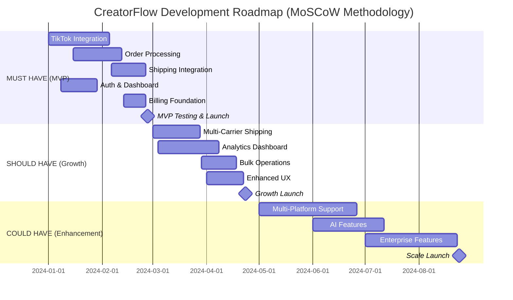
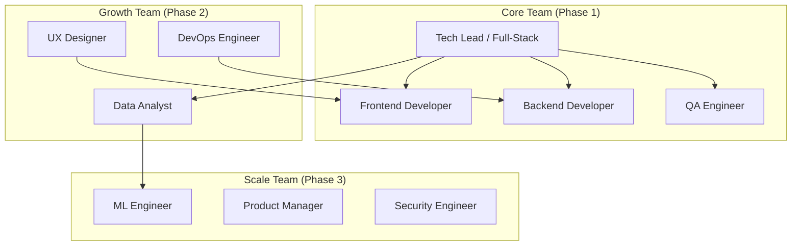
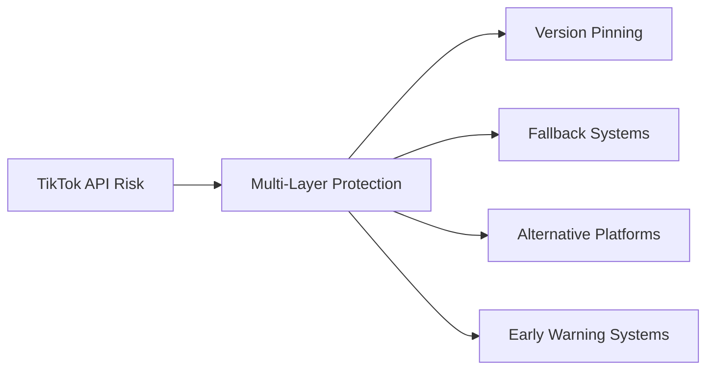

# I001-DRAFT: CreatorFlow Implementation Roadmap (MoSCoW-Based)

## 🎯 Executive Summary

This document outlines the implementation roadmap for CreatorFlow's TikTok Shop fulfillment automation platform, organized by MoSCoW priorities and designed to achieve $10M ARR within 24 months. This roadmap integrates advanced capabilities from CDH (UI/UX) and QuoteKit (billing, analytics, content, Edge Functions) to create an enterprise-grade platform that scales creators from 50 to 500+ orders per day.

## 📅 Implementation Timeline Overview

## 🔴 Phase 1: MUST HAVE Implementation (Weeks 1-12)

### Sprint 1-2: Foundation Setup (Weeks 1-4)
**Goal**: Establish technical foundation and core integrations

#### Sprint 1 (Week 1-2): Project Setup & TikTok OAuth
- [ ] **Project initialization** with Next.js 15 + TypeScript (CDH architecture patterns)
- [ ] **Supabase setup** with authentication and database + Edge Functions foundation
- [ ] **TikTok Shop OAuth flow** implementation
- [ ] **Basic security** setup (CORS, rate limiting) + QuoteKit security patterns
- [ ] **CI/CD pipeline** configuration
- [ ] **Shadcn/ui components** foundation from CDH repository

**Deliverables**:
- Working OAuth connection to TikTok Shop
- Modern UI foundation with CDH design system
- Basic project structure with documentation
- Development environment setup guide

#### Sprint 2 (Week 3-4): Webhook Infrastructure & User Auth
- [ ] **TikTok webhook endpoint** with signature verification (QuoteKit webhook patterns)
- [ ] **User authentication** with Supabase Auth (magic links)
- [ ] **Basic user profile** management with CDH components
- [ ] **Database schema** for core entities with RLS policies
- [ ] **Error handling** and logging infrastructure
- [ ] **QuoteKit connection pooling** foundation for high-volume processing

**Deliverables**:
- Enterprise-grade webhook processing system
- Professional user registration and login flow
- Core database schema with security policies
- Connection pooling for scalability

### Sprint 3-4: Core Processing Engine (Weeks 5-8)
**Goal**: Build reliable order processing and shipping integration

#### Sprint 3 (Week 5-6): Order Processing Core
- [ ] **Order ingestion** from TikTok webhooks
- [ ] **Order validation** and data normalization
- [ ] **State machine** for order lifecycle management
- [ ] **Retry mechanism** for failed operations
- [ ] **Audit logging** for all order events

**Deliverables**:
- Robust order processing engine
- Order state management system
- Comprehensive error handling

#### Sprint 4 (Week 7-8): Shipping Integration
- [ ] **Shippo API integration** for label generation
- [ ] **Address validation** and normalization
- [ ] **Tracking number** capture and storage
- [ ] **TikTok Shop status updates** (fulfillment sync)
- [ ] **Basic shipping cost** calculation

**Deliverables**:
- End-to-end shipping label generation
- Automatic order fulfillment updates
- Shipping cost tracking

### Sprint 5-6: User Interface & Billing (Weeks 9-12)
**Goal**: Complete MVP with user dashboard and subscription billing

#### Sprint 5 (Week 9-10): Dashboard Development
- [ ] **Dashboard layout** with navigation
- [ ] **Order overview** with statistics
- [ ] **Order list** with filtering and search
- [ ] **Order detail view** with tracking info
- [ ] **Responsive design** for mobile/desktop

**Deliverables**:
- Complete user dashboard
- Order management interface
- Mobile-responsive design

#### Sprint 6 (Week 11-12): Billing & MVP Launch
- [ ] **QuoteKit Stripe integration** for enterprise-grade subscriptions
- [ ] **Usage-based pricing tiers** ($49-$199/month based on order volume)
- [ ] **Customer portal** for self-service subscription management
- [ ] **Usage tracking** for automatic plan upgrades
- [ ] **QuoteKit webhook handler** for reliable payment processing
- [ ] **MVP testing** and bug fixes with CDH components

**Deliverables**:
- Enterprise billing system with usage-based pricing
- Self-service subscription management portal
- MVP ready for beta launch with professional UI

### MVP Success Criteria
- [ ] **Functional TikTok Shop integration** with real orders
- [ ] **Automated shipping label generation** (>95% success rate)
- [ ] **User dashboard** with order management
- [ ] **Subscription billing** with three tiers
- [ ] **<24 hour time to first value** for new users
- [ ] **Security audit** passed
- [ ] **Performance benchmarks** met (<2s page loads)

---

## 🟡 Phase 2: SHOULD HAVE Implementation (Weeks 13-24)

### Sprint 7-8: Multi-Carrier Enhancement (Weeks 13-16)
**Goal**: Add carrier options and rate optimization

#### Sprint 7 (Week 13-14): EasyPost Integration
- [ ] **EasyPost API** integration and testing
- [ ] **Rate comparison** engine development
- [ ] **Carrier preference** settings
- [ ] **Service level selection** (ground, express, overnight)

#### Sprint 8 (Week 15-16): Rate Shopping & Optimization
- [ ] **Automatic rate shopping** algorithm
- [ ] **Carrier performance tracking**
- [ ] **Cost optimization** recommendations
- [ ] **Shipping analytics** foundation

**Deliverables**:
- Multi-carrier shipping options
- Intelligent rate selection
- Shipping cost optimization

### Sprint 9-10: Analytics & Communication System (Weeks 17-20)
**Goal**: Implement QuoteKit's PostHog analytics and communication infrastructure

#### Sprint 9 (Week 17-18): PostHog Analytics Foundation
- [ ] **PostHog integration** with HogQL queries and rate limiting
- [ ] **TikTok Shop specific analytics** queries and dashboards
- [ ] **Real-time metrics** with 5-minute caching system
- [ ] **Event tracking** for order processing and user behavior

#### Sprint 10 (Week 19-20): Communication & Feedback System
- [ ] **Resend email integration** for automated notifications
- [ ] **Formbricks feedback system** with smart survey targeting
- [ ] **Creator success metrics** and milestone celebrations
- [ ] **Performance insights** dashboard with business intelligence

**Deliverables**:
- Enterprise-grade analytics with PostHog
- Automated email communication system
- User feedback and survey management
- Advanced business intelligence dashboard

### Sprint 11-12: Bulk Operations & UX (Weeks 21-24)
**Goal**: Scale user efficiency and improve experience

#### Sprint 11 (Week 21-22): Bulk Operations
- [ ] **Bulk order selection** and processing
- [ ] **Batch label generation** and printing
- [ ] **Automated processing rules**
- [ ] **Scheduled processing** windows

#### Sprint 12 (Week 23-24): Enhanced User Experience & Content
- [ ] **CDH onboarding flow** with glassmorphism effects and modern UI
- [ ] **QuoteKit MDX blog system** for educational content and case studies
- [ ] **Content creation** for "50 to 500 orders" success stories
- [ ] **Interactive tutorials** and creator education platform
- [ ] **Performance optimizations** with Edge Functions

**Deliverables**:
- Bulk processing capabilities
- Professional blog platform with educational content
- Enhanced user onboarding with premium UI
- Creator success story content for marketing

### Growth Phase Success Criteria
- [ ] **Multi-carrier integration** with 3+ providers
- [ ] **15% average shipping cost** reduction
- [ ] **Advanced analytics** with 80% user engagement
- [ ] **Bulk operations** saving 70% time for high-volume users
- [ ] **<5% monthly churn rate**
- [ ] **$100+ average MRR** per customer

---

## 🟢 Phase 3: COULD HAVE Implementation (Weeks 25-36)

### Sprint 13-14: Advanced Edge Functions & Infrastructure (Weeks 25-28)
**Goal**: Implement QuoteKit's advanced Edge Functions for enterprise scalability

#### Sprint 13-14: Enterprise Infrastructure
- [ ] **QuoteKit Edge Functions** migration (17+ specialized functions)
- [ ] **Advanced connection pooling** (19KB implementation) for high-volume processing
- [ ] **Batch processing engine** for handling 500+ orders per day
- [ ] **Performance optimization** system (34KB implementation)
- [ ] **Global deployment optimizer** for multi-region support

### Sprint 15-16: Multi-Platform Expansion (Weeks 29-32)
**Goal**: Expand beyond TikTok Shop to other platforms

#### Platform Integration Priority
1. **Instagram Shopping** (Weeks 29-30)
2. **Shopify Integration** (Weeks 31-32)
3. **Amazon FBA** (Future consideration)

#### Sprint 13-14: Instagram Shopping Integration
- [ ] **Instagram Shopping API** integration
- [ ] **Cross-platform order** normalization
- [ ] **Unified dashboard** for multiple platforms
- [ ] **Platform-specific** shipping rules

#### Sprint 15-16: Shopify Integration
- [ ] **Shopify API** integration and webhooks
- [ ] **Inventory synchronization** across platforms
- [ ] **Cross-platform analytics**
- [ ] **Unified customer** management

**Deliverables**:
- Multi-platform order management
- Cross-platform inventory sync
- Unified analytics dashboard

### Sprint 17-18: AI-Powered Features (Weeks 33-36)
**Goal**: Add intelligent automation and optimization

#### AI Feature Development
- [ ] **Inventory demand forecasting** ML model
- [ ] **Fraud detection** system
- [ ] **Dynamic pricing** optimization
- [ ] **Customer lifetime value** prediction

**Deliverables**:
- AI-powered business insights
- Automated optimization recommendations
- Predictive analytics capabilities

### Enhancement Phase Success Criteria
- [ ] **Multi-platform support** with 40% adoption
- [ ] **AI features** improving KPIs by 20%
- [ ] **Enterprise features** for agency customers
- [ ] **$199+ premium tier** adoption
- [ ] **International expansion** readiness

---

## 📊 Resource Allocation & Team Structure

### Development Team Structure

### Sprint Capacity Planning
- **Phase 1 (MVP)**: 4 developers × 12 weeks = 48 developer-weeks
- **Phase 2 (Growth)**: 6 developers × 12 weeks = 72 developer-weeks  
- **Phase 3 (Scale)**: 8 developers × 12 weeks = 96 developer-weeks

### Budget Allocation by Phase (Updated with CDH/QuoteKit Integration)
| Phase | Development | Infrastructure | Marketing | Total |
|-------|-------------|----------------|-----------|-------|
| Phase 1 (MVP) | $300K | $30K | $50K | $380K |
| Phase 2 (Growth) | $420K | $60K | $120K | $600K |
| Phase 3 (Scale) | $600K | $100K | $250K | $950K |
| **Total Investment** | **$1.32M** | **$190K** | **$420K** | **$1.93M** |

**Investment Justification**: Higher development costs reflect enterprise-grade implementations from QuoteKit (billing, analytics, Edge Functions) and CDH (premium UI/UX) that justify $49-$199/month pricing tiers and support $10M ARR target.

---

## 🎯 Comprehensive Risk Management & Mitigation Strategy

### 🛠️ Execution Difficulty Assessment: 6/10 (Moderate Complexity)
**Timeline**: 6-month MVP with strategic mitigation planning
**Complexity Drivers**: API integrations, automation requirements, scalability challenges

## 🚨 PRIMARY EXECUTION RISKS & MITIGATION PLANS

### 1. 🔗 API Access Limitations & Changes from TikTok

#### Risk Details
- **Probability**: High (7/10) - TikTok frequently updates policies and API access
- **Impact**: Critical (9/10) - Could halt core functionality
- **Timeline Risk**: Could delay MVP by 2-4 weeks

#### Comprehensive Mitigation Strategy

**Immediate Actions (Week 1-2)**:
- [ ] **Establish TikTok Partner Relationship** - Apply for official partner status
- [ ] **API Version Pinning** - Lock to stable API versions with 6-month compatibility guarantees
- [ ] **Webhook Redundancy** - Implement backup webhook endpoints and polling mechanisms
- [ ] **Legal Review** - Ensure compliance with TikTok's Terms of Service and API policies

**Short-term Safeguards (Month 1-3)**:
- [ ] **Multi-Platform Strategy** - Begin Instagram Shopping integration in parallel
- [ ] **API Monitoring System** - Real-time tracking of API health and deprecation notices
- [ ] **Communication Bridge** - Direct line to TikTok developer relations team
- [ ] **Backward Compatibility Layer** - Abstraction layer for seamless API version transitions

**Long-term Protection (Month 4-6)**:
- [ ] **Platform Diversification** - Shopify, Amazon, eBay integrations as fallback options
- [ ] **Data Export Tools** - Allow creators to migrate order history if needed
- [ ] **Independent Analytics** - Reduce dependency on TikTok's analytics APIs

### 2. ⚙️ Automation Errors Affecting Order Processing

#### Risk Details
- **Probability**: Medium-High (6/10) - Complex automation chains increase error potential
- **Impact**: High (8/10) - Could damage creator businesses and platform reputation
- **Financial Impact**: $10K-$50K in lost revenue per major incident

#### Comprehensive Mitigation Strategy

**Error Prevention (Must Have - Phase 1)**:
- [ ] **Multi-Stage Validation** - Order validation at webhook, processing, and fulfillment stages
- [ ] **Idempotency Controls** - Prevent duplicate order processing with unique transaction IDs
- [ ] **Rate Limiting** - Prevent API rate limit violations with intelligent queuing
- [ ] **Data Integrity Checks** - Verify order data consistency across all systems

**Error Detection & Recovery (Should Have - Phase 2)**:
- [ ] **Real-time Monitoring** - QuoteKit Edge Functions for <5 second error detection
- [ ] **Automatic Rollback** - Revert failed operations to previous stable state
- [ ] **Smart Retry Logic** - Exponential backoff with maximum retry limits
- [ ] **Manual Override System** - Allow creators to manually process failed orders

**Business Continuity (Could Have - Phase 3)**:
- [ ] **Order Processing Insurance** - Partner with insurance provider for automation errors
- [ ] **24/7 Monitoring Team** - Dedicated support for high-volume creators
- [ ] **Predictive Error Prevention** - ML models to identify potential failure patterns

### 3. 📈 Scalability Issues as User Base Grows

#### Risk Details
- **Probability**: High (8/10) - Growth success creates scalability challenges
- **Impact**: High (8/10) - Could cause platform outages during viral creator moments
- **Growth Trigger**: 1,000+ creators processing 100K+ orders/day

#### Comprehensive Mitigation Strategy

**Infrastructure Scaling (QuoteKit Foundation)**:
- [ ] **Advanced Connection Pooling** - 19KB implementation supporting 50+ concurrent connections
- [ ] **Edge Functions Architecture** - 17+ specialized functions for global distribution
- [ ] **Batch Processing Engine** - Handle 10,000+ orders per minute during viral spikes
- [ ] **Auto-scaling Database** - Supabase with read replicas and connection pooling

**Performance Optimization**:
- [ ] **CDN Implementation** - Global content delivery for sub-500ms response times
- [ ] **Caching Strategy** - Multi-layer caching for frequently accessed data
- [ ] **Queue Management** - Priority-based processing for high-value creators
- [ ] **Load Testing** - Regular stress testing with 10x expected traffic

**Business Scaling Preparation**:
- [ ] **Tiered Support System** - Dedicated account managers for high-volume creators
- [ ] **White-glove Onboarding** - Specialized setup for creators processing 500+ orders/day
- [ ] **Enterprise SLA** - 99.9% uptime guarantee for premium tier customers

## 🔧 TECHNICAL CHALLENGES MITIGATION

### TikTok API Integration Complexity

#### Challenge Details
- **Integration Points**: OAuth, Webhooks, Order Management, Product Catalog
- **Complexity Score**: 7/10
- **Documentation Quality**: Limited and frequently changing

#### Mitigation Approach
**Phase 1 (Weeks 1-4): Foundation**
- [ ] **API Sandbox Environment** - Comprehensive testing before production deployment
- [ ] **SDK Development** - Custom TypeScript SDK for TikTok Shop APIs
- [ ] **Integration Testing Suite** - Automated tests for all API endpoints
- [ ] **Documentation System** - Internal documentation with examples and edge cases

**Phase 2 (Weeks 5-8): Resilience**
- [ ] **Circuit Breaker Pattern** - Prevent cascade failures during API outages
- [ ] **Graceful Degradation** - Continue core operations when API features are unavailable
- [ ] **API Version Management** - Support multiple API versions simultaneously
- [ ] **Error Classification** - Categorize errors for appropriate response strategies

### Inventory & Order Management Automation

#### Challenge Details
- **Synchronization Complexity**: Real-time inventory across multiple sales channels
- **Data Consistency**: Ensuring order state consistency during high-volume periods
- **Integration Points**: TikTok Shop, shipping carriers, payment processors

#### Mitigation Approach
**Data Architecture (QuoteKit Patterns)**:
- [ ] **Event-Driven Architecture** - Immutable event log for order state changes
- [ ] **CQRS Implementation** - Separate read/write models for optimal performance
- [ ] **Eventual Consistency** - Accept temporary inconsistency for high availability
- [ ] **Conflict Resolution** - Automated resolution of inventory conflicts

**Automation Safeguards**:
- [ ] **Inventory Buffers** - Maintain safety stock levels to prevent overselling
- [ ] **Multi-level Confirmation** - Require confirmation for high-value or high-quantity orders
- [ ] **Anomaly Detection** - Flag unusual ordering patterns for manual review
- [ ] **Rollback Capabilities** - Ability to reverse automated actions when errors occur

### Payment Gateway Integration

#### Challenge Details
- **Compliance Requirements**: PCI DSS, financial regulations
- **Multiple Payment Methods**: Credit cards, digital wallets, BNPL services
- **International Markets**: Currency conversion, tax calculation

#### Mitigation Approach
**QuoteKit Stripe Integration (76KB+ Implementation)**:
- [ ] **Enterprise Webhook Handler** - Robust payment event processing
- [ ] **Subscription Management** - Usage-based billing with automatic upgrades
- [ ] **Payment Method Flexibility** - Support for 15+ payment methods globally
- [ ] **Fraud Detection** - AI-powered fraud prevention and chargeback protection

## 🤝 NON-TECHNICAL CHALLENGES MITIGATION

### Gaining User Trust in Automation Solutions

#### Challenge Details
- **Trust Barrier**: Small business owners cautious about automating critical processes
- **Competition**: Established manual processes and competitor solutions
- **Education Need**: Creators need to understand automation benefits and risks

#### Mitigation Strategy

**Trust Building (Must Have)**:
- [ ] **Transparent Operations** - Real-time dashboard showing all automated actions
- [ ] **Manual Override Controls** - Allow creators to pause or modify automation at any time
- [ ] **Small-scale Pilots** - Start with low-risk order types and gradually expand
- [ ] **Insurance Coverage** - Provide automation error insurance for peace of mind

**Social Proof & Education**:
- [ ] **Case Study Content** - QuoteKit MDX blog with "50 to 500 orders" success stories
- [ ] **Video Testimonials** - Creator testimonials showing tangible benefits
- [ ] **Interactive Onboarding** - Guided setup process with safety explanations
- [ ] **Community Building** - Creator success community and peer learning

**Risk Mitigation Communication**:
- [ ] **Transparent Pricing** - Clear usage-based pricing with no hidden costs
- [ ] **Money-back Guarantee** - 30-day full refund for unsatisfied customers
- [ ] **24/7 Support** - Live chat and phone support during critical periods
- [ ] **Regular Check-ins** - Proactive account management for new users

### Navigating TikTok's Evolving Policies

#### Challenge Details
- **Policy Changes**: TikTok frequently updates seller and API policies
- **Compliance Risk**: Non-compliance could result in creator account suspension
- **Global Variations**: Different policies across international markets

#### Mitigation Strategy

**Policy Monitoring & Compliance**:
- [ ] **Legal Advisory Board** - E-commerce and platform policy experts
- [ ] **Policy Tracking System** - Automated monitoring of TikTok policy changes
- [ ] **Compliance Dashboard** - Real-time compliance status for all creator accounts
- [ ] **Update Notification System** - Immediate alerts when policies affect platform operations

**Proactive Compliance**:
- [ ] **Conservative Approach** - Implement stricter controls than minimum requirements
- [ ] **Regular Compliance Audits** - Monthly review of platform operations and creator accounts
- [ ] **Policy Buffer Period** - Implement changes 30 days before policy deadlines
- [ ] **Alternative Platform Readiness** - Maintain integrations with backup platforms

### Marketing to Small Business Owners with Limited Budgets

#### Challenge Details
- **Budget Constraints**: Target market has limited marketing budgets
- **High CAC Risk**: Customer acquisition costs could exceed LTV
- **Education Required**: Need to educate market on automation benefits

#### Mitigation Strategy

**Cost-Effective Marketing (Phase 2 Focus)**:
- [ ] **Content Marketing** - SEO-optimized blog content targeting "TikTok Shop automation"
- [ ] **Referral Program** - 30% commission for successful creator referrals
- [ ] **Community Partnerships** - Partner with TikTok creator groups and communities
- [ ] **Freemium Model** - Free tier for creators processing <50 orders/month

**Value Demonstration**:
- [ ] **ROI Calculator** - Interactive tool showing time and cost savings
- [ ] **Free Trial Period** - 14-day free trial with full feature access
- [ ] **Success Metrics Dashboard** - Show time saved, errors prevented, revenue protected
- [ ] **Comparison Tools** - Compare costs vs. hiring virtual assistants or employees

**Organic Growth Strategies**:
- [ ] **Creator Success Stories** - Organic word-of-mouth from successful customers
- [ ] **TikTok Content Strategy** - Create educational content on TikTok platform itself
- [ ] **Partnership with Shipping Companies** - Co-marketing with FedEx, UPS, etc.
- [ ] **Industry Conference Presence** - E-commerce and creator economy events

## 📊 Risk Monitoring & Early Warning Systems

### Risk Dashboard KPIs
- **API Health Score**: >95% uptime across all integrated APIs
- **Automation Success Rate**: >99% successful order processing
- **Customer Satisfaction**: >4.5/5 rating on automation reliability
- **Platform Performance**: <2 second response times under normal load
- **Financial Impact**: <$1K monthly loss due to automation errors

### Escalation Procedures
1. **Level 1 (Automated)**: System auto-recovery and error logging
2. **Level 2 (Engineering)**: Development team investigation and fix
3. **Level 3 (Business)**: Customer communication and manual processing
4. **Level 4 (Executive)**: Major incident response and platform-wide communication

### Success Metrics for Risk Mitigation
- **Zero Creator Account Suspensions** due to policy violations
- **<0.1% Order Processing Errors** affecting creator businesses
- **99.9% Uptime** during peak shopping periods (Black Friday, holidays)
- **<30 Second Recovery Time** from API failures using fallback systems

## 📈 BUSINESS RISK SUMMARY TABLE

| Risk Category | Risk | Probability | Impact | Mitigation Investment | Timeline |
|---------------|------|-------------|--------|---------------------|----------|
| **API/Technical** | TikTok API Changes | High (7/10) | Critical (9/10) | $50K (partner relationship, redundancy) | Week 1-2 |
| **Operational** | Automation Errors | Med-High (6/10) | High (8/10) | $75K (monitoring, insurance, testing) | Phase 1 |
| **Infrastructure** | Scalability Issues | High (8/10) | High (8/10) | $150K (Edge Functions, load testing) | Phase 2-3 |
| **Market** | User Trust Building | Med-High (6/10) | High (8/10) | $40K (content, guarantees, support) | Phase 1-2 |
| **Regulatory** | TikTok Policy Changes | Medium (5/10) | High (8/10) | $30K (legal advisory, compliance) | Ongoing |
| **Marketing** | High CAC vs LTV | Medium (5/10) | Medium (6/10) | $60K (content marketing, referrals) | Phase 2 |

**Total Risk Mitigation Investment**: $405K (21% of $1.93M total budget)
**Risk-Adjusted Timeline**: 6-month MVP with 2-week buffer for API complications

### Contingency Plans
- **API Deprecation**: Maintain compatibility layers and migration paths
- **Competitive Pressure**: Accelerate unique feature development
- **Technical Debt**: Allocate 20% of sprint capacity to refactoring
- **Team Scaling**: Implement mentorship and knowledge transfer programs

---

## 📈 Success Metrics & KPIs

### Phase 1 (MVP) KPIs
- **Technical**: 99% uptime, <2s page loads, 95% webhook success
- **Business**: 100 paying customers, <10% churn, $75 average MRR
- **User**: <24h time to value, 4.0+ satisfaction rating

### Phase 2 (Growth) KPIs
- **Technical**: 99.5% uptime, <1s page loads, 99% webhook success
- **Business**: 1,000 paying customers, <5% churn, $100 average MRR
- **User**: 90% feature adoption, 4.5+ satisfaction rating

### Phase 3 (Scale) KPIs
- **Technical**: 99.9% uptime, <500ms page loads, 99.9% webhook success
- **Business**: 8,333 paying customers, <3% churn, $100 average MRR ($10M ARR)
- **User**: 95% feature adoption, 4.8+ satisfaction rating
- **Platform**: Handle 500+ orders/day per creator, support viral order spikes

---

## 🔄 Review & Adjustment Process

### Weekly Sprint Reviews
- **Progress assessment** against sprint goals
- **Blocker identification** and resolution
- **Scope adjustment** based on learnings
- **Quality metrics** review and improvement

### Monthly Roadmap Reviews
- **MoSCoW priority** reassessment
- **Market feedback** integration
- **Competitive analysis** updates
- **Resource allocation** optimization

### Quarterly Strategic Reviews
- **Business goal alignment** verification
- **Technical architecture** evolution
- **Team structure** optimization
- **Market expansion** planning

---

## 🚀 Next Steps

### Immediate Actions (Next 2 Weeks)
1. **Finalize team hiring** for Phase 1 development
2. **Set up development environment** and CI/CD pipeline
3. **Create detailed sprint backlogs** for first 4 sprints
4. **Establish monitoring and alerting** infrastructure
5. **Begin TikTok Shop API** integration development

### Phase 1 Preparation
1. **Technical architecture** review and approval
2. **Security requirements** definition and implementation
3. **Performance benchmarks** establishment
4. **Quality assurance** process setup
5. **Beta user recruitment** for MVP testing

---

*This implementation roadmap will be updated bi-weekly based on development progress, market feedback, and business priorities. All changes will be documented and communicated to stakeholders.*

**Status**: DRAFT - Updated with CDH and QuoteKit integration findings
**Last Updated**: 2025-01-02
**Next Review**: 2025-01-16

## 📚 Integration References

This roadmap incorporates findings from comprehensive repository analysis:

### CDH Integration (UI/UX Enhancement)
- **Modern design system** with Shadcn/ui components and glassmorphism effects
- **Professional landing pages** and pricing components
- **Interactive elements** and particle animations for premium user experience

### QuoteKit Integration (Enterprise Infrastructure)
- **Advanced Stripe billing** (76KB+ webhook handler) for usage-based pricing
- **PostHog analytics** (18KB+ implementation) with HogQL queries and caching
- **Formbricks feedback system** (300KB+ complete implementation)
- **Resend email integration** for automated communication
- **MDX blog system** for educational content and case studies
- **Edge Functions** (17+ specialized functions) for enterprise scalability
- **Connection pooling** (19KB+ implementation) for high-volume processing

### Business Model Alignment
- **Target Market**: TikTok Shop creators scaling from 50 to 500+ orders/day
- **Pricing Strategy**: $49-$199/month usage-based subscription tiers
- **Revenue Target**: $10M ARR (8,333 customers × $100 average MRR)
- **Value Proposition**: Eliminate operational bottlenecks for viral TikTok products
