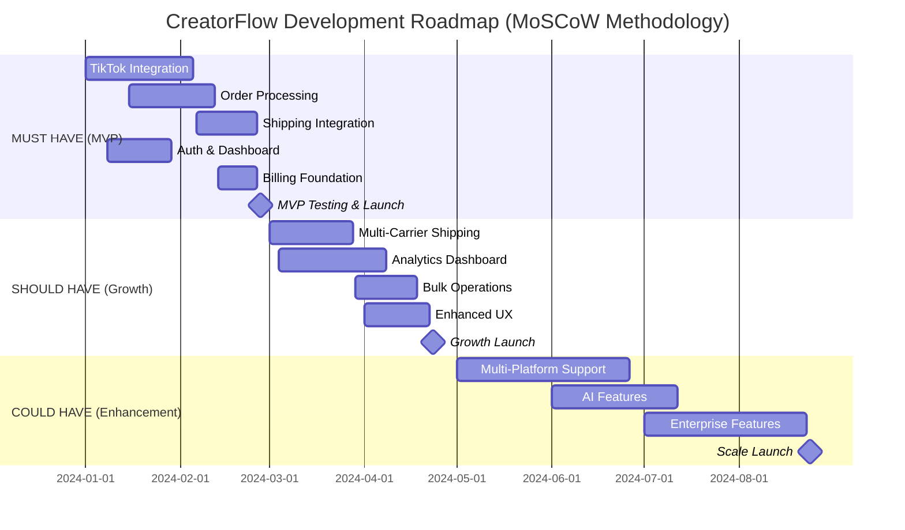
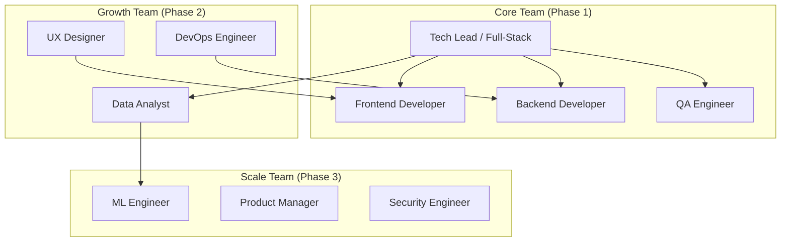

# I001-DRAFT: CreatorFlow Implementation Roadmap (MoSCoW-Based)

## 🎯 Executive Summary

This document outlines the implementation roadmap for CreatorFlow's TikTok Shop fulfillment automation platform, organized by MoSCoW priorities and designed to achieve $10M ARR within 24 months.

## 📅 Implementation Timeline Overview

## 🔴 Phase 1: MUST HAVE Implementation (Weeks 1-12)

### Sprint 1-2: Foundation Setup (Weeks 1-4)
**Goal**: Establish technical foundation and core integrations

#### Sprint 1 (Week 1-2): Project Setup & TikTok OAuth
- [ ] **Project initialization** with Next.js 15 + TypeScript
- [ ] **Supabase setup** with authentication and database
- [ ] **TikTok Shop OAuth flow** implementation
- [ ] **Basic security** setup (CORS, rate limiting)
- [ ] **CI/CD pipeline** configuration

**Deliverables**:
- Working OAuth connection to TikTok Shop
- Basic project structure with documentation
- Development environment setup guide

#### Sprint 2 (Week 3-4): Webhook Infrastructure & User Auth
- [ ] **TikTok webhook endpoint** with signature verification
- [ ] **User authentication** with Supabase Auth (magic links)
- [ ] **Basic user profile** management
- [ ] **Database schema** for core entities
- [ ] **Error handling** and logging infrastructure

**Deliverables**:
- Secure webhook processing system
- User registration and login flow
- Core database schema implementation

### Sprint 3-4: Core Processing Engine (Weeks 5-8)
**Goal**: Build reliable order processing and shipping integration

#### Sprint 3 (Week 5-6): Order Processing Core
- [ ] **Order ingestion** from TikTok webhooks
- [ ] **Order validation** and data normalization
- [ ] **State machine** for order lifecycle management
- [ ] **Retry mechanism** for failed operations
- [ ] **Audit logging** for all order events

**Deliverables**:
- Robust order processing engine
- Order state management system
- Comprehensive error handling

#### Sprint 4 (Week 7-8): Shipping Integration
- [ ] **Shippo API integration** for label generation
- [ ] **Address validation** and normalization
- [ ] **Tracking number** capture and storage
- [ ] **TikTok Shop status updates** (fulfillment sync)
- [ ] **Basic shipping cost** calculation

**Deliverables**:
- End-to-end shipping label generation
- Automatic order fulfillment updates
- Shipping cost tracking

### Sprint 5-6: User Interface & Billing (Weeks 9-12)
**Goal**: Complete MVP with user dashboard and subscription billing

#### Sprint 5 (Week 9-10): Dashboard Development
- [ ] **Dashboard layout** with navigation
- [ ] **Order overview** with statistics
- [ ] **Order list** with filtering and search
- [ ] **Order detail view** with tracking info
- [ ] **Responsive design** for mobile/desktop

**Deliverables**:
- Complete user dashboard
- Order management interface
- Mobile-responsive design

#### Sprint 6 (Week 11-12): Billing & MVP Launch
- [ ] **Stripe integration** for subscriptions
- [ ] **Pricing tiers** implementation (Starter/Growth/Scale)
- [ ] **Customer portal** for subscription management
- [ ] **Usage tracking** for order limits
- [ ] **MVP testing** and bug fixes

**Deliverables**:
- Complete billing system
- Subscription management
- MVP ready for beta launch

### MVP Success Criteria
- [ ] **Functional TikTok Shop integration** with real orders
- [ ] **Automated shipping label generation** (>95% success rate)
- [ ] **User dashboard** with order management
- [ ] **Subscription billing** with three tiers
- [ ] **<24 hour time to first value** for new users
- [ ] **Security audit** passed
- [ ] **Performance benchmarks** met (<2s page loads)

---

## 🟡 Phase 2: SHOULD HAVE Implementation (Weeks 13-24)

### Sprint 7-8: Multi-Carrier Enhancement (Weeks 13-16)
**Goal**: Add carrier options and rate optimization

#### Sprint 7 (Week 13-14): EasyPost Integration
- [ ] **EasyPost API** integration and testing
- [ ] **Rate comparison** engine development
- [ ] **Carrier preference** settings
- [ ] **Service level selection** (ground, express, overnight)

#### Sprint 8 (Week 15-16): Rate Shopping & Optimization
- [ ] **Automatic rate shopping** algorithm
- [ ] **Carrier performance tracking**
- [ ] **Cost optimization** recommendations
- [ ] **Shipping analytics** foundation

**Deliverables**:
- Multi-carrier shipping options
- Intelligent rate selection
- Shipping cost optimization

### Sprint 9-10: Analytics & Insights (Weeks 17-20)
**Goal**: Provide business intelligence and performance metrics

#### Sprint 9 (Week 17-18): Analytics Infrastructure
- [ ] **Analytics database** design and setup
- [ ] **Event tracking** system implementation
- [ ] **Data aggregation** pipeline
- [ ] **Real-time metrics** calculation

#### Sprint 10 (Week 19-20): Dashboard Analytics
- [ ] **Revenue and profit** tracking
- [ ] **Order volume** trends and forecasting
- [ ] **Shipping cost** analysis
- [ ] **Customer insights** and segmentation

**Deliverables**:
- Comprehensive analytics system
- Business intelligence dashboard
- Performance optimization insights

### Sprint 11-12: Bulk Operations & UX (Weeks 21-24)
**Goal**: Scale user efficiency and improve experience

#### Sprint 11 (Week 21-22): Bulk Operations
- [ ] **Bulk order selection** and processing
- [ ] **Batch label generation** and printing
- [ ] **Automated processing rules**
- [ ] **Scheduled processing** windows

#### Sprint 12 (Week 23-24): Enhanced User Experience
- [ ] **Onboarding flow** optimization
- [ ] **Notification system** (email/SMS)
- [ ] **Help documentation** and tutorials
- [ ] **Performance optimizations**

**Deliverables**:
- Bulk processing capabilities
- Enhanced user onboarding
- Comprehensive help system

### Growth Phase Success Criteria
- [ ] **Multi-carrier integration** with 3+ providers
- [ ] **15% average shipping cost** reduction
- [ ] **Advanced analytics** with 80% user engagement
- [ ] **Bulk operations** saving 70% time for high-volume users
- [ ] **<5% monthly churn rate**
- [ ] **$100+ average MRR** per customer

---

## 🟢 Phase 3: COULD HAVE Implementation (Weeks 25-36)

### Sprint 13-16: Multi-Platform Expansion (Weeks 25-32)
**Goal**: Expand beyond TikTok Shop to other platforms

#### Platform Integration Priority
1. **Instagram Shopping** (Weeks 25-28)
2. **Shopify Integration** (Weeks 29-32)
3. **Amazon FBA** (Future consideration)

#### Sprint 13-14: Instagram Shopping Integration
- [ ] **Instagram Shopping API** integration
- [ ] **Cross-platform order** normalization
- [ ] **Unified dashboard** for multiple platforms
- [ ] **Platform-specific** shipping rules

#### Sprint 15-16: Shopify Integration
- [ ] **Shopify API** integration and webhooks
- [ ] **Inventory synchronization** across platforms
- [ ] **Cross-platform analytics**
- [ ] **Unified customer** management

**Deliverables**:
- Multi-platform order management
- Cross-platform inventory sync
- Unified analytics dashboard

### Sprint 17-18: AI-Powered Features (Weeks 33-36)
**Goal**: Add intelligent automation and optimization

#### AI Feature Development
- [ ] **Inventory demand forecasting** ML model
- [ ] **Fraud detection** system
- [ ] **Dynamic pricing** optimization
- [ ] **Customer lifetime value** prediction

**Deliverables**:
- AI-powered business insights
- Automated optimization recommendations
- Predictive analytics capabilities

### Enhancement Phase Success Criteria
- [ ] **Multi-platform support** with 40% adoption
- [ ] **AI features** improving KPIs by 20%
- [ ] **Enterprise features** for agency customers
- [ ] **$199+ premium tier** adoption
- [ ] **International expansion** readiness

---

## 📊 Resource Allocation & Team Structure

### Development Team Structure

### Sprint Capacity Planning
- **Phase 1 (MVP)**: 4 developers × 12 weeks = 48 developer-weeks
- **Phase 2 (Growth)**: 6 developers × 12 weeks = 72 developer-weeks  
- **Phase 3 (Scale)**: 8 developers × 12 weeks = 96 developer-weeks

### Budget Allocation by Phase
| Phase | Development | Infrastructure | Marketing | Total |
|-------|-------------|----------------|-----------|-------|
| Phase 1 | $240K | $20K | $40K | $300K |
| Phase 2 | $360K | $40K | $100K | $500K |
| Phase 3 | $480K | $60K | $200K | $740K |

---

## 🎯 Risk Management & Mitigation

### Technical Risks
| Risk | Probability | Impact | Mitigation Strategy |
|------|-------------|--------|-------------------|
| TikTok API Changes | Medium | High | Version pinning, fallback mechanisms |
| Shipping API Downtime | Medium | Medium | Multi-carrier redundancy |
| Database Performance | Low | High | Proper indexing, connection pooling |
| Security Vulnerabilities | Low | Critical | Regular audits, penetration testing |

### Business Risks
| Risk | Probability | Impact | Mitigation Strategy |
|------|-------------|--------|-------------------|
| Market Competition | High | Medium | Rapid feature development, customer focus |
| TikTok Policy Changes | Medium | High | Diversify to multiple platforms |
| Customer Acquisition Cost | Medium | Medium | Referral programs, content marketing |
| Churn Rate | Medium | High | Customer success focus, feature adoption |

### Contingency Plans
- **API Deprecation**: Maintain compatibility layers and migration paths
- **Competitive Pressure**: Accelerate unique feature development
- **Technical Debt**: Allocate 20% of sprint capacity to refactoring
- **Team Scaling**: Implement mentorship and knowledge transfer programs

---

## 📈 Success Metrics & KPIs

### Phase 1 (MVP) KPIs
- **Technical**: 99% uptime, <2s page loads, 95% webhook success
- **Business**: 100 paying customers, <10% churn, $75 average MRR
- **User**: <24h time to value, 4.0+ satisfaction rating

### Phase 2 (Growth) KPIs
- **Technical**: 99.5% uptime, <1s page loads, 99% webhook success
- **Business**: 1,000 paying customers, <5% churn, $100 average MRR
- **User**: 90% feature adoption, 4.5+ satisfaction rating

### Phase 3 (Scale) KPIs
- **Technical**: 99.9% uptime, <500ms page loads, 99.9% webhook success
- **Business**: 5,000 paying customers, <3% churn, $150 average MRR
- **User**: 95% feature adoption, 4.8+ satisfaction rating

---

## 🔄 Review & Adjustment Process

### Weekly Sprint Reviews
- **Progress assessment** against sprint goals
- **Blocker identification** and resolution
- **Scope adjustment** based on learnings
- **Quality metrics** review and improvement

### Monthly Roadmap Reviews
- **MoSCoW priority** reassessment
- **Market feedback** integration
- **Competitive analysis** updates
- **Resource allocation** optimization

### Quarterly Strategic Reviews
- **Business goal alignment** verification
- **Technical architecture** evolution
- **Team structure** optimization
- **Market expansion** planning

---

## 🚀 Next Steps

### Immediate Actions (Next 2 Weeks)
1. **Finalize team hiring** for Phase 1 development
2. **Set up development environment** and CI/CD pipeline
3. **Create detailed sprint backlogs** for first 4 sprints
4. **Establish monitoring and alerting** infrastructure
5. **Begin TikTok Shop API** integration development

### Phase 1 Preparation
1. **Technical architecture** review and approval
2. **Security requirements** definition and implementation
3. **Performance benchmarks** establishment
4. **Quality assurance** process setup
5. **Beta user recruitment** for MVP testing

---

*This implementation roadmap will be updated bi-weekly based on development progress, market feedback, and business priorities. All changes will be documented and communicated to stakeholders.*

**Status**: DRAFT - Pending user validation and approval
**Last Updated**: 2024-01-01
**Next Review**: 2024-01-15
