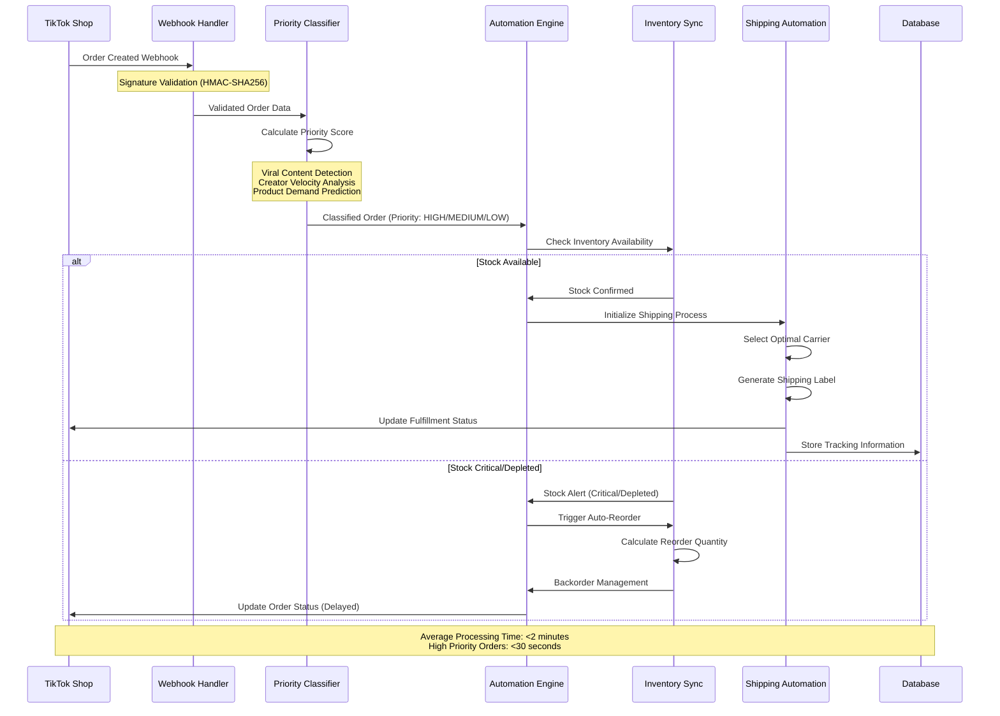
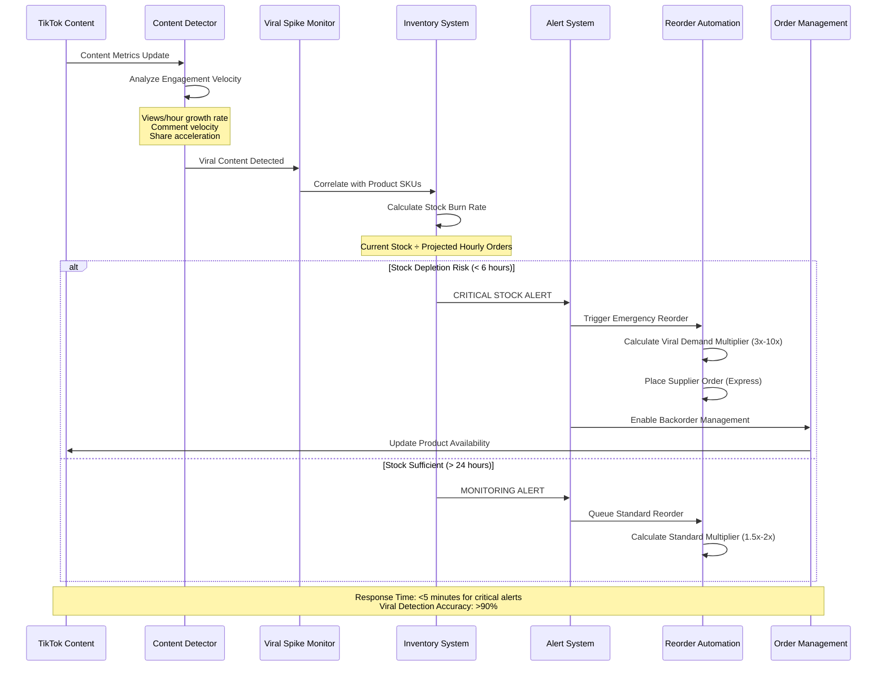
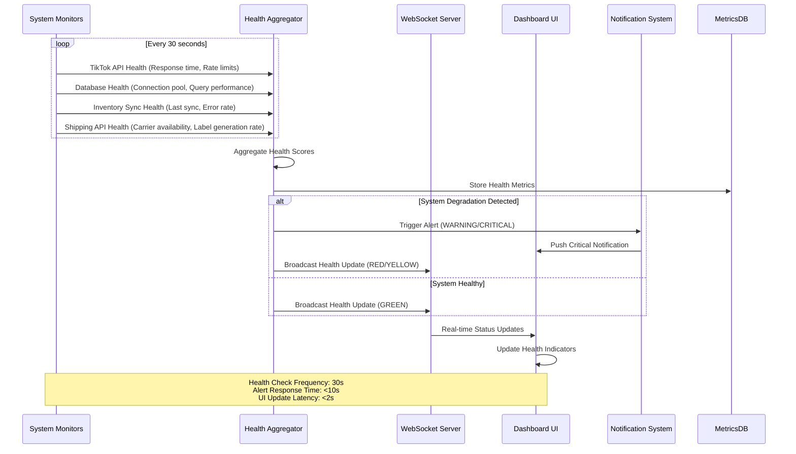

# S001: Cross-System Integration Flow Specifications

**Document Type**: Technical Specification  
**Priority**: Must Have  
**Status**: Active Development  
**Created**: 2025-01-09  
**Last Updated**: 2025-01-09  

## Executive Summary

This specification defines comprehensive cross-system integration flows for CreatorFlow's four core systems: TikTok Shop API, Order Management System, Inventory Tracking, and Shipping Automation. Based on analysis of 96 integration touchpoints identified in mock components, this document maps critical data flows, real-time requirements, and integration patterns.

## MoSCoW Prioritization

### Must Have (M) - Core Integration Flows
- **TikTok Order Webhook Processing**: Signature validation, order creation, priority classification
- **Real-time Order Status Synchronization**: Bidirectional sync between TikTok and internal systems
- **Critical Stock Alert System**: Viral content detection → order spike → inventory depletion prediction
- **Automated Shipping Label Generation**: Order processing → carrier selection → label creation
- **Cross-system Error Handling**: Retry logic, fallback mechanisms, data integrity preservation

### Should Have (S) - Enhanced Integration Features
- **Performance Optimization**: Connection pooling, request batching, intelligent caching
- **Advanced Rate Limiting**: Dynamic throttling based on API quotas and system load
- **Comprehensive Monitoring**: Real-time health checks, performance metrics, alert escalation
- **Data Transformation Pipeline**: Standardized format conversion between systems
- **Conflict Resolution**: Concurrent update handling, version control, merge strategies

### Could Have (C) - Advanced Integration Capabilities
- **Predictive Stock Reordering**: ML-based demand forecasting integrated with viral content detection
- **Multi-region Failover**: Geographic load distribution for global TikTok Shop operations
- **Advanced Analytics Integration**: Real-time business intelligence data flows
- **Third-party Marketplace Integration**: Extensible framework for additional platforms

### Won't Have (W) - Out of Scope
- **Direct TikTok Content Creation**: Content management and publishing tools
- **Customer Service Chat Integration**: End-user support systems
- **Accounting System Integration**: Financial reporting and tax preparation
- **Social Media Analytics**: Content performance tracking outside order correlation

## Four Core System Architecture

### System Boundaries and Responsibilities

```mermaid
graph TB
    subgraph "TikTok Shop API System"
        TK_API[TikTok Shop API]
        TK_WEBHOOK[Webhook Handler]
        TK_AUTH[OAuth Manager]
        TK_RATE[Rate Limiter]
    end
    
    subgraph "Order Management System"
        OM_ENGINE[Automation Engine]
        OM_PRIORITY[Priority Classifier]
        OM_STATE[State Machine]
        OM_RULES[Business Rules]
    end
    
    subgraph "Inventory Tracking System"
        INV_SYNC[Real-time Sync]
        INV_PREDICT[Stock Predictor]
        INV_ALERT[Critical Alerts]
        INV_REORDER[Auto Reorder]
    end
    
    subgraph "Shipping Automation System"
        SHIP_CARRIER[Carrier Selector]
        SHIP_LABEL[Label Generator]
        SHIP_TRACK[Tracking Manager]
        SHIP_NOTIFY[Notifications]
    end
    
    TK_WEBHOOK --> OM_PRIORITY
    OM_ENGINE --> INV_SYNC
    OM_STATE --> SHIP_CARRIER
    INV_ALERT --> OM_RULES
    INV_PREDICT --> INV_REORDER
    SHIP_TRACK --> TK_API
```



## Critical Data Flow #1: TikTok Order Processing

### Flow Sequence: Order Creation to Fulfillment



### Data Transformation Points

```typescript
interface TikTokOrderWebhook {
  order_id: string;
  shop_id: string;
  order_status: 'UNPAID' | 'ON_HOLD' | 'AWAITING_SHIPMENT' | 'AWAITING_COLLECTION';
  create_time: number;
  update_time: number;
  order_lines: TikTokOrderLine[];
  shipping_info: TikTokShippingInfo;
  payment_info: TikTokPaymentInfo;
}

interface InternalOrder {
  id: string;
  tiktok_order_id: string;
  user_id: string;
  priority_score: number; // 1-100 scale
  status: OrderStatus;
  items: OrderItem[];
  shipping_address: ShippingAddress;
  created_at: timestamp;
  updated_at: timestamp;
  // Relationships
  inventory_reservations?: InventoryReservation[];
  shipping_labels?: ShippingLabel[];
}

// Priority Classification Logic
interface PriorityFactors {
  creator_velocity_multiplier: number; // 1.0-5.0 based on recent viral content
  product_demand_score: number; // Real-time demand analysis
  customer_tier: 'NEW' | 'REPEAT' | 'VIP'; // Customer segmentation
  inventory_urgency: number; // Stock level consideration
  shipping_complexity: number; // Address/carrier complexity
}
```

## Critical Data Flow #2: Viral Content Response

### Flow Sequence: Content Goes Viral → Order Spike → Stock Management



### Viral Detection Algorithm

```typescript
interface ViralDetectionMetrics {
  view_velocity: number; // views per hour growth rate
  engagement_rate: number; // likes + comments + shares / views
  velocity_acceleration: number; // hour-over-hour growth acceleration
  content_age_hours: number; // time since publication
  creator_follower_count: number; // audience size factor
}

interface StockPrediction {
  current_stock: number;
  hourly_burn_rate: number; // units sold per hour
  projected_depletion_hours: number;
  confidence_level: number; // 0-100% prediction confidence
  recommended_reorder_quantity: number;
  supplier_lead_time_hours: number;
}

class ViralContentDetector {
  calculateViralScore(metrics: ViralDetectionMetrics): number {
    const velocityScore = Math.min(metrics.view_velocity / 10000, 100); // Cap at 100
    const engagementScore = metrics.engagement_rate * 100;
    const accelerationScore = Math.min(metrics.velocity_acceleration * 50, 100);
    const timeDecayFactor = Math.max(1 - (metrics.content_age_hours / 24), 0.1);
    
    return (velocityScore * 0.4 + engagementScore * 0.3 + accelerationScore * 0.3) * timeDecayFactor;
  }
  
  predictStockDepletion(viralScore: number, currentStock: number, normalHourlyRate: number): StockPrediction {
    const viralMultiplier = Math.pow(viralScore / 10, 1.5); // Exponential scaling
    const projectedHourlyRate = normalHourlyRate * viralMultiplier;
    
    return {
      current_stock: currentStock,
      hourly_burn_rate: projectedHourlyRate,
      projected_depletion_hours: currentStock / projectedHourlyRate,
      confidence_level: Math.min(viralScore, 95),
      recommended_reorder_quantity: Math.ceil(projectedHourlyRate * 72), // 3 days supply
      supplier_lead_time_hours: 24 // Express shipping assumption
    };
  }
}
```

## Critical Data Flow #3: Real-Time System Health

### Flow Sequence: System Monitoring → Status Aggregation → UI Updates



### Health Monitoring Schema

```typescript
interface SystemHealthMetrics {
  system: 'tiktok_api' | 'order_management' | 'inventory_tracking' | 'shipping_automation';
  timestamp: Date;
  status: 'healthy' | 'degraded' | 'critical' | 'down';
  response_time_ms: number;
  error_rate_percent: number;
  throughput_per_minute: number;
  details: SystemSpecificMetrics;
}

interface TikTokAPIMetrics extends SystemSpecificMetrics {
  rate_limit_remaining: number;
  rate_limit_reset_time: Date;
  webhook_processing_rate: number;
  failed_webhook_count: number;
  oauth_token_validity: boolean;
}

interface InventoryTrackingMetrics extends SystemSpecificMetrics {
  last_sync_time: Date;
  sync_success_rate: number;
  critical_stock_items_count: number;
  auto_reorder_queue_length: number;
  viral_detection_active: boolean;
}

// Real-time WebSocket Event Types
interface HealthStatusUpdate {
  type: 'HEALTH_UPDATE';
  overall_status: 'healthy' | 'degraded' | 'critical';
  systems: {
    [key: string]: {
      status: string;
      last_check: Date;
      response_time: number;
    };
  };
  active_alerts: AlertDefinition[];
}
```

## Integration Patterns and Architecture

### 1. Webhook Processing Pattern

```typescript
// Webhook validation and processing pipeline
class WebhookProcessor {
  async processWebhook(request: Request): Promise<WebhookResponse> {
    // Step 1: Signature Validation
    const signature = request.headers.get('x-tiktok-shop-signature');
    const isValid = await this.validateSignature(request.body, signature);
    
    if (!isValid) {
      throw new WebhookValidationError('Invalid signature');
    }
    
    // Step 2: Idempotency Check
    const eventId = request.headers.get('x-tiktok-shop-event-id');
    const isProcessed = await this.checkIdempotency(eventId);
    
    if (isProcessed) {
      return { status: 'already_processed', event_id: eventId };
    }
    
    // Step 3: Event Processing
    const event = JSON.parse(request.body);
    const result = await this.routeEvent(event);
    
    // Step 4: Mark as Processed
    await this.markProcessed(eventId, result);
    
    return result;
  }
}
```

### 2. Rate Limiting and Retry Logic

```typescript
class RateLimitedAPIClient {
  private rateLimiter = new TokenBucket({
    capacity: 1000, // TikTok Shop API limit
    refillRate: 16.67, // requests per second
    window: 60000 // 1 minute window
  });
  
  async makeRequest<T>(endpoint: string, options: RequestOptions): Promise<T> {
    // Wait for rate limit token
    await this.rateLimiter.waitForToken();
    
    try {
      const response = await this.httpClient.request(endpoint, options);
      return response.data;
    } catch (error) {
      if (this.isRetryableError(error)) {
        return this.retryWithBackoff(endpoint, options, error.retryAfter);
      }
      throw error;
    }
  }
  
  private async retryWithBackoff<T>(
    endpoint: string, 
    options: RequestOptions, 
    retryAfter?: number
  ): Promise<T> {
    const delays = [1000, 2000, 4000, 8000]; // Exponential backoff
    
    for (const [attempt, delay] of delays.entries()) {
      await new Promise(resolve => setTimeout(resolve, retryAfter || delay));
      
      try {
        await this.rateLimiter.waitForToken();
        const response = await this.httpClient.request(endpoint, options);
        return response.data;
      } catch (error) {
        if (attempt === delays.length - 1 || !this.isRetryableError(error)) {
          throw error;
        }
      }
    }
    
    throw new Error('Max retries exceeded');
  }
}
```

### 3. Data Transformation Pipeline

```typescript
interface DataTransformer<TInput, TOutput> {
  transform(input: TInput): Promise<TOutput>;
  validate(output: TOutput): boolean;
}

class TikTokOrderTransformer implements DataTransformer<TikTokOrderWebhook, InternalOrder> {
  async transform(tiktokOrder: TikTokOrderWebhook): Promise<InternalOrder> {
    return {
      id: generateUUID(),
      tiktok_order_id: tiktokOrder.order_id,
      user_id: await this.resolveUserId(tiktokOrder.shop_id),
      priority_score: await this.calculatePriority(tiktokOrder),
      status: this.mapOrderStatus(tiktokOrder.order_status),
      items: await this.transformOrderItems(tiktokOrder.order_lines),
      shipping_address: this.transformShippingAddress(tiktokOrder.shipping_info),
      created_at: new Date(tiktokOrder.create_time * 1000),
      updated_at: new Date()
    };
  }
  
  validate(order: InternalOrder): boolean {
    return (
      !!order.id &&
      !!order.tiktok_order_id &&
      !!order.user_id &&
      order.priority_score >= 1 && order.priority_score <= 100 &&
      order.items.length > 0 &&
      !!order.shipping_address.street1
    );
  }
}
```

### 4. Conflict Resolution Strategy

```typescript
interface ConflictResolver<T> {
  resolveConflict(local: T, remote: T, metadata: ConflictMetadata): Promise<T>;
}

class OrderStatusConflictResolver implements ConflictResolver<Order> {
  async resolveConflict(
    localOrder: Order, 
    tiktokOrder: Order, 
    metadata: ConflictMetadata
  ): Promise<Order> {
    // Last-writer-wins with business logic validation
    const localTime = localOrder.updated_at.getTime();
    const remoteTime = tiktokOrder.updated_at.getTime();
    
    // TikTok Shop is authoritative for payment and cancellation status
    if (tiktokOrder.status === 'CANCELLED' || tiktokOrder.status === 'REFUNDED') {
      return tiktokOrder;
    }
    
    // Local system is authoritative for fulfillment status
    if (localOrder.status === 'SHIPPED' || localOrder.status === 'DELIVERED') {
      // Sync shipping status back to TikTok Shop
      await this.syncShippingStatusToTikTok(localOrder);
      return localOrder;
    }
    
    // For other conflicts, use timestamp-based resolution
    return remoteTime > localTime ? tiktokOrder : localOrder;
  }
}
```

## Performance Optimization Strategies

### Connection Pooling and Caching

```typescript
class OptimizedAPIClient {
  private connectionPool = new ConnectionPool({
    maxConnections: 50,
    keepAlive: true,
    timeout: 30000
  });
  
  private cache = new Redis({
    host: process.env.REDIS_HOST,
    ttl: 300, // 5 minute default TTL
    serializer: JSON
  });
  
  async getWithCache<T>(
    key: string, 
    fetcher: () => Promise<T>, 
    ttl?: number
  ): Promise<T> {
    // Try cache first
    const cached = await this.cache.get(key);
    if (cached) {
      return cached;
    }
    
    // Fetch and cache
    const data = await fetcher();
    await this.cache.set(key, data, ttl);
    return data;
  }
}
```

### Request Batching

```typescript
class BatchProcessor {
  private batches = new Map<string, BatchRequest[]>();
  private timers = new Map<string, NodeJS.Timeout>();
  
  async batchRequest<T>(
    batchKey: string,
    request: BatchRequest,
    options: BatchOptions = {}
  ): Promise<T> {
    return new Promise((resolve, reject) => {
      // Add to batch
      if (!this.batches.has(batchKey)) {
        this.batches.set(batchKey, []);
      }
      
      const batch = this.batches.get(batchKey)!;
      batch.push({ ...request, resolve, reject });
      
      // Set or reset timer
      if (this.timers.has(batchKey)) {
        clearTimeout(this.timers.get(batchKey)!);
      }
      
      const timer = setTimeout(() => {
        this.processBatch(batchKey);
      }, options.batchTimeout || 100);
      
      this.timers.set(batchKey, timer);
      
      // Process if batch is full
      if (batch.length >= (options.batchSize || 50)) {
        clearTimeout(timer);
        this.processBatch(batchKey);
      }
    });
  }
}
```

## Error Handling and Recovery

### Circuit Breaker Pattern

```typescript
class CircuitBreaker {
  private state: 'CLOSED' | 'OPEN' | 'HALF_OPEN' = 'CLOSED';
  private failures = 0;
  private lastFailureTime = 0;
  
  constructor(
    private failureThreshold = 5,
    private recoveryTimeout = 60000, // 1 minute
    private monitoringPeriod = 600000 // 10 minutes
  ) {}
  
  async execute<T>(operation: () => Promise<T>): Promise<T> {
    if (this.state === 'OPEN') {
      if (Date.now() - this.lastFailureTime > this.recoveryTimeout) {
        this.state = 'HALF_OPEN';
      } else {
        throw new CircuitBreakerOpenError('Circuit breaker is OPEN');
      }
    }
    
    try {
      const result = await operation();
      
      if (this.state === 'HALF_OPEN') {
        this.state = 'CLOSED';
        this.failures = 0;
      }
      
      return result;
    } catch (error) {
      this.recordFailure();
      throw error;
    }
  }
  
  private recordFailure(): void {
    this.failures++;
    this.lastFailureTime = Date.now();
    
    if (this.failures >= this.failureThreshold) {
      this.state = 'OPEN';
    }
  }
}
```

## System Health Monitoring

### Comprehensive Health Checks

```typescript
class SystemHealthMonitor {
  private healthChecks: HealthCheck[] = [
    new TikTokAPIHealthCheck(),
    new DatabaseHealthCheck(),
    new InventorySyncHealthCheck(),
    new ShippingAPIHealthCheck(),
    new RedisHealthCheck()
  ];
  
  async performHealthCheck(): Promise<SystemHealth> {
    const results = await Promise.allSettled(
      this.healthChecks.map(check => check.execute())
    );
    
    const systemHealth: SystemHealth = {
      overall_status: 'healthy',
      timestamp: new Date(),
      checks: {}
    };
    
    for (const [index, result] of results.entries()) {
      const checkName = this.healthChecks[index].name;
      
      if (result.status === 'fulfilled') {
        systemHealth.checks[checkName] = result.value;
      } else {
        systemHealth.checks[checkName] = {
          status: 'critical',
          error: result.reason.message,
          timestamp: new Date()
        };
        systemHealth.overall_status = 'critical';
      }
    }
    
    // Determine overall status
    const statuses = Object.values(systemHealth.checks).map(c => c.status);
    if (statuses.includes('critical')) {
      systemHealth.overall_status = 'critical';
    } else if (statuses.includes('degraded')) {
      systemHealth.overall_status = 'degraded';
    }
    
    return systemHealth;
  }
}
```

## Performance Benchmarks

### Target Performance Metrics

| Integration Flow | Target Response Time | Success Rate | Throughput |
|------------------|---------------------|--------------|------------|
| TikTok Webhook Processing | <500ms | 99.9% | 1000 requests/min |
| Order Priority Classification | <100ms | 99.5% | 5000 orders/min |
| Inventory Stock Check | <50ms | 99.9% | 10000 checks/min |
| Shipping Label Generation | <2s | 99.5% | 500 labels/min |
| Viral Content Detection | <5s | >90% accuracy | 1000 analyses/min |
| System Health Monitoring | <1s | 100% | Every 30s |

### Load Testing Scenarios

```typescript
interface LoadTestScenario {
  name: string;
  concurrent_users: number;
  requests_per_second: number;
  duration_minutes: number;
  expected_success_rate: number;
}

const loadTestScenarios: LoadTestScenario[] = [
  {
    name: 'Normal Operation',
    concurrent_users: 50,
    requests_per_second: 100,
    duration_minutes: 30,
    expected_success_rate: 99.9
  },
  {
    name: 'Viral Spike Simulation',
    concurrent_users: 500,
    requests_per_second: 1000,
    duration_minutes: 15,
    expected_success_rate: 99.5
  },
  {
    name: 'Black Friday Load',
    concurrent_users: 1000,
    requests_per_second: 2000,
    duration_minutes: 60,
    expected_success_rate: 99.0
  }
];
```

## Implementation Roadmap

### Phase 1: Core Integration (Must Have) - 4 weeks
1. **Week 1**: TikTok Shop webhook processing and validation
2. **Week 2**: Order management system integration
3. **Week 3**: Inventory tracking and sync implementation
4. **Week 4**: Shipping automation and label generation

### Phase 2: Real-time Features (Should Have) - 3 weeks
1. **Week 5**: Viral content detection and stock prediction
2. **Week 6**: Real-time system health monitoring
3. **Week 7**: Performance optimization and caching

### Phase 3: Advanced Features (Could Have) - 3 weeks
1. **Week 8**: Advanced analytics integration
2. **Week 9**: Multi-region failover capabilities
3. **Week 10**: Comprehensive monitoring dashboard

## Risk Assessment and Mitigation

### High-Risk Integration Points

1. **TikTok Shop API Rate Limiting**
   - **Risk**: API quota exhaustion during viral spikes
   - **Mitigation**: Intelligent rate limiting, request prioritization, fallback strategies

2. **Real-time Data Synchronization**
   - **Risk**: Data inconsistency during high-load scenarios
   - **Mitigation**: Event sourcing, conflict resolution algorithms, eventual consistency patterns

3. **Inventory Prediction Accuracy**
   - **Risk**: Over/under-ordering due to false viral detection
   - **Mitigation**: Machine learning model validation, confidence scoring, human oversight triggers

4. **System Performance Under Load**
   - **Risk**: Response time degradation during traffic spikes
   - **Mitigation**: Auto-scaling, connection pooling, circuit breakers, performance monitoring

## Success Metrics

### Technical Metrics
- **System Uptime**: >99.9%
- **Average Response Time**: <500ms for critical paths
- **Data Consistency**: >99.99% accuracy across systems
- **Error Rate**: <0.1% for all integration points

### Business Metrics
- **Order Processing Automation**: >90% fully automated
- **Stock-out Prevention**: >95% accuracy in viral spike prediction
- **Shipping Label Generation**: <2 minute average processing time
- **Customer Satisfaction**: >4.8/5 rating for fulfillment speed

## Related Documents

- [TikTok Shop API Integration Specifications](../../../integrations/tiktok-shop/01-specifications/S001-DRAFT-api-integration-specifications.md)
- [CreatorFlow Architecture Overview](../../../architecture/README.md)
- [Order Management System Design](../../../features/order-management/01-specifications/S001-order-workflow-specifications.md)
- [Inventory Management System](../../../features/inventory-management/01-specifications/S001-inventory-tracking-specifications.md)
- [Shipping Automation Integration](../../../features/shipping/01-specifications/S001-shipping-integration-specifications.md)
- [Real-time Monitoring Framework](../../../monitoring/01-specifications/S001-system-health-monitoring.md)