# I001-DRAFT: Visual Integration Flow Diagrams

**Document Type**: Implementation Guide  
**Priority**: Must Have  
**Status**: Draft Implementation  
**Created**: 2025-01-09  
**Last Updated**: 2025-01-09  

## Overview

This document provides detailed visual representations of CreatorFlow's cross-system integration flows, including sequence diagrams, architecture diagrams, and data flow visualizations for the four core systems.

## Integration Architecture Overview

### High-Level System Integration Map


## Detailed Integration Flow #1: Order Processing Pipeline

### Complete Order Lifecycle - From TikTok to Delivery


## Integration Flow #2: Viral Content Detection & Stock Management

### Viral Spike Response - Content to Emergency Reorder

```mermaid
sequenceDiagram
    participant TC as TikTok Content
    participant CD as Content Monitor
    participant VD as Viral Detector
    participant IS as Inventory System
    participant AS as Alert System
    participant RO as Reorder System
    participant SP as Supplier Portal
    participant OM as Order Management
    participant UI as Creator Dashboard
    participant EMAIL as Email System

    Note over TC,EMAIL: Viral Content Response Flow
    
    %% Content Monitoring
    loop Every 5 minutes
        CD->>+TC: Fetch Content Metrics
        TC-->>-CD: Views, Engagement, Growth Rate
    end
    
    CD->>+VD: Analyze Content Performance
    Note over VD: Content ID: VID_789<br/>Views: 2.1M (↑850% in 2h)<br/>Engagement: 15.2%<br/>Share velocity: 1200/hour
    
    VD->>VD: Calculate Viral Score
    Note over VD: View velocity: 95/100<br/>Engagement rate: 85/100<br/>Acceleration: 92/100<br/>Time decay: 0.95<br/>VIRAL SCORE: 91/100
    
    VD->>+IS: Correlate with Products
    Note over IS: Content mentions:<br/>- iPhone Case Pro (SKU: ICP_001)<br/>- Phone Grip Stand (SKU: PGS_002)<br/>Product correlation: 95%
    
    IS->>IS: Analyze Stock Impact
    Note over IS: ICP_001 Current Stock: 89 units<br/>Normal velocity: 3/hour<br/>Viral multiplier: 7.2x<br/>New velocity: 21.6/hour<br/>Depletion time: 4.1 hours
    
    IS-->>-VD: Stock Analysis Complete
    VD-->>-CD: Viral Alert Triggered
    
    %% Critical Stock Alert
    CD->>+AS: CRITICAL VIRAL STOCK ALERT
    Note over AS: Priority: CRITICAL<br/>Product: iPhone Case Pro<br/>Stock remaining: 4.1 hours<br/>Confidence: 91%
    
    AS->>+UI: Real-time Alert
    Note over UI: 🚨 CRITICAL STOCK ALERT<br/>iPhone Case Pro<br/>89 units remaining<br/>4.1 hours at current rate
    UI-->>-AS: Alert Displayed
    
    AS->>+EMAIL: Send Alert Email
    Note over EMAIL: Subject: URGENT - Stock Depletion Alert<br/>Content going viral<br/>Immediate action required
    EMAIL-->>-AS: Alert Sent
    
    %% Automated Response
    AS->>+RO: Trigger Emergency Reorder
    Note over RO: Auto-reorder enabled<br/>Emergency threshold: <6 hours<br/>Viral demand multiplier: 7x
    
    RO->>RO: Calculate Order Quantity
    Note over RO: Viral duration estimate: 48 hours<br/>Peak demand: 25 units/hour<br/>Total need: 1,200 units<br/>Current stock: 89<br/>Order quantity: 1,500 (safety buffer)
    
    RO->>+SP: Place Emergency Order
    Note over SP: Product: iPhone Case Pro<br/>Quantity: 1,500 units<br/>Shipping: Express (24h)<br/>Cost: $4,875 + $299 shipping
    SP-->>-RO: Order Confirmed (PO_456)
    
    %% System Updates
    RO->>+IS: Update Reorder Status
    IS->>IS: Create Reorder Record
    Note over IS: Expected arrival: 22 hours<br/>Temporary shortage risk<br/>Enable backorder management
    IS-->>-RO: Status Updated
    
    RO->>+OM: Enable Backorder Mode
    Note over OM: Product: iPhone Case Pro<br/>Mode: Accept backorders<br/>Estimated fulfillment: 24-48h
    OM-->>-RO: Backorder Mode Active
    
    %% Real-time Dashboard Updates
    RO->>+UI: Update Dashboard
    Note over UI: 📦 Emergency reorder placed<br/>1,500 units ordered<br/>Arrival: 22 hours<br/>Status: Backorder mode active
    UI-->>-RO: Dashboard Updated
    
    %% Continuous Monitoring
    loop Every 10 minutes
        VD->>IS: Update Burn Rate
        Note over IS: Monitor actual vs predicted<br/>Adjust algorithms<br/>Alert if deviation >20%
        IS->>UI: Real-time Stock Updates
    end
    
    Note over TC,EMAIL: Response Time: <5 minutes<br/>Automation Level: 95%<br/>Human Intervention: Only for approval
```



## Integration Flow #3: Real-Time System Health Monitoring

### System Health Aggregation & Alert Flow

```mermaid
sequenceDiagram
    participant SM as System Monitors
    participant TM as TikTok Monitor
    participant OM as Order Monitor
    participant IM as Inventory Monitor
    participant ShM as Shipping Monitor
    participant HA as Health Aggregator
    participant DB as MetricsDB
    participant WS as WebSocket Server
    participant UI as Dashboard
    participant AS as Alert System
    participant SL as Slack/Email

    Note over SM,SL: System Health Monitoring Flow
    
    %% Parallel Health Checks
    par TikTok API Health
        SM->>+TM: Check TikTok API
        TM->>TM: Test API endpoint
        Note over TM: Response time: 245ms<br/>Rate limit: 847/1000<br/>Success rate: 99.8%
        TM-->>-SM: Status: HEALTHY
    and Order System Health
        SM->>+OM: Check Order Processing
        OM->>OM: Test order pipeline
        Note over OM: Queue length: 12<br/>Avg processing: 1.2s<br/>Error rate: 0.1%
        OM-->>-SM: Status: HEALTHY
    and Inventory Health
        SM->>+IM: Check Inventory Sync
        IM->>IM: Test sync endpoints
        Note over IM: Last sync: 45s ago<br/>Success rate: 99.5%<br/>Alert queue: 3
        IM-->>-SM: Status: DEGRADED
    and Shipping Health
        SM->>+ShM: Check Shipping APIs
        ShM->>ShM: Test all carriers
        Note over ShM: USPS: 1.2s (HEALTHY)<br/>UPS: 3.4s (DEGRADED)<br/>FedEx: 0.8s (HEALTHY)
        ShM-->>-SM: Status: DEGRADED
    end
    
    %% Health Aggregation
    SM->>+HA: Aggregate Health Data
    Note over HA: TikTok: HEALTHY<br/>Orders: HEALTHY<br/>Inventory: DEGRADED<br/>Shipping: DEGRADED<br/>Overall: DEGRADED
    
    HA->>HA: Calculate Health Score
    Note over HA: Score calculation:<br/>Critical systems weight: 40%<br/>Non-critical: 20%<br/>Overall score: 78/100
    
    HA->>+DB: Store Metrics
    DB->>DB: Insert Health Record
    Note over DB: Timestamp: now<br/>Overall: DEGRADED<br/>Details: JSON blob
    DB-->>-HA: Metrics Stored
    
    %% Real-time Updates
    HA->>+WS: Broadcast Health Update
    Note over WS: Event: HEALTH_UPDATE<br/>Status: DEGRADED<br/>Affected: Inventory, Shipping
    
    WS->>+UI: Push to Dashboard
    Note over UI: Health indicator: YELLOW<br/>Details popup available<br/>Affected systems highlighted
    UI-->>-WS: UI Updated
    WS-->>-HA: Broadcast Complete
    
    %% Alert Processing
    HA->>+AS: Check Alert Thresholds
    Note over AS: Current score: 78<br/>Warning threshold: 80<br/>Critical threshold: 60<br/>Action: Send Warning
    
    AS->>+SL: Send Alert
    Note over SL: 🟡 CreatorFlow Health Warning<br/>System performance degraded<br/>Inventory sync delayed<br/>UPS API responding slowly
    SL-->>-AS: Alert Sent
    AS-->>-HA: Alert Processed
    HA-->>-SM: Health Check Complete
    
    %% Continuous Monitoring Loop
    loop Every 30 seconds
        SM->>HA: Repeat Health Checks
        Note over HA: Continuous monitoring<br/>Trend analysis<br/>Predictive alerting
    end
    
    Note over SM,SL: Check Frequency: 30 seconds<br/>Alert Response: <10 seconds<br/>Dashboard Latency: <2 seconds
```



## Cross-System Data Flow Patterns

### Event-Driven Architecture Flow


## WebSocket Real-Time Communication Flow

### Real-Time Dashboard Updates Architecture

```mermaid
sequenceDiagram
    participant CLIENT as Dashboard Client
    participant WS as WebSocket Server
    participant AUTH as Auth Service
    participant EVENT as Event System
    participant DB as Database
    participant CACHE as Redis Cache

    Note over CLIENT,CACHE: WebSocket Connection & Real-Time Updates
    
    %% Connection Establishment
    CLIENT->>+WS: WebSocket Connection
    WS->>+AUTH: Validate JWT Token
    AUTH-->>-WS: User Validated (user_id: 123)
    
    WS->>WS: Store Connection
    Note over WS: Connection Map:<br/>user_123: ws_connection<br/>Subscriptions: orders, inventory, health
    WS-->>-CLIENT: Connection Established
    
    %% Real-time Event Processing
    EVENT->>+WS: New Order Event
    Note over EVENT: Event: order.created<br/>Order ID: ORD_456<br/>User ID: 123<br/>Priority: HIGH
    
    WS->>WS: Check Subscriptions
    Note over WS: User 123 subscribed to orders<br/>Send update to client
    
    WS->>+CACHE: Get Cached Order Summary
    CACHE-->>-WS: Order Count: 47, Revenue: $2,890
    
    WS->>+DB: Get Order Details
    DB-->>-WS: Order Details: {id, status, items, total}
    
    WS->>CLIENT: Real-time Update
    Note over CLIENT: {<br/>  type: 'ORDER_CREATED',<br/>  order: {...},<br/>  summary: {...}<br/>}
    
    %% Inventory Alert
    EVENT->>+WS: Stock Alert Event
    Note over EVENT: Event: inventory.critical<br/>SKU: PHONE_CASE<br/>Stock: 12 units<br/>Depletion: 4.2 hours
    
    WS->>CLIENT: Critical Alert
    Note over CLIENT: 🚨 CRITICAL STOCK ALERT<br/>Phone Case: 12 units left<br/>Auto-reorder triggered
    
    %% Health Status Update
    loop Every 30 seconds
        EVENT->>WS: Health Status Update
        WS->>CLIENT: System Health
        Note over CLIENT: Health indicator update<br/>All systems: GREEN
    end
    
    %% Connection Management
    CLIENT->>WS: Heartbeat Ping
    WS-->>CLIENT: Pong Response
    
    Note over CLIENT,CACHE: Connection Type: WebSocket<br/>Update Latency: <100ms<br/>Heartbeat: 30s
```



## API Integration Patterns

### TikTok Shop API Integration Flow


## Performance Optimization Architecture

### Caching and Performance Layer


## Error Handling and Recovery Flow

### Circuit Breaker and Fallback Strategy


### Fallback Strategy Flow


## Monitoring and Alerting Architecture

### Comprehensive Monitoring Dashboard Flow

```mermaid
graph TB
    subgraph "Data Collection"
        APP_METRICS[Application Metrics<br/>Response Times, Errors]
        SYSTEM_METRICS[System Metrics<br/>CPU, Memory, Network]
        BUSINESS_METRICS[Business Metrics<br/>Orders, Revenue, Conversion]
        EXTERNAL_METRICS[External API Metrics<br/>TikTok, Shipping, Stripe]
    end
    
    subgraph "Metrics Processing"
        AGGREGATOR[Metrics Aggregator]
        CALCULATOR[Health Calculator]
        THRESHOLD_CHECKER[Threshold Checker]
        TREND_ANALYZER[Trend Analyzer]
    end
    
    subgraph "Storage"
        TIME_SERIES_DB[(Time Series Database)]
        ALERTS_DB[(Alerts Database)]
        METRICS_CACHE[Metrics Cache<br/>Hot Data]
    end
    
    subgraph "Alerting"
        ALERT_MANAGER[Alert Manager]
        ESCALATION_RULES[Escalation Rules]
        NOTIFICATION_ROUTER[Notification Router]
    end
    
    subgraph "Notifications"
        SLACK[Slack Notifications]
        EMAIL[Email Alerts]
        SMS[SMS (Critical Only)]
        WEBHOOK[Custom Webhooks]
    end
    
    subgraph "Dashboards"
        REAL_TIME_DASH[Real-time Dashboard]
        BUSINESS_DASH[Business Dashboard]
        TECHNICAL_DASH[Technical Dashboard]
        MOBILE_DASH[Mobile Dashboard]
    end
    
    %% Data Flow
    APP_METRICS --> AGGREGATOR
    SYSTEM_METRICS --> AGGREGATOR
    BUSINESS_METRICS --> AGGREGATOR
    EXTERNAL_METRICS --> AGGREGATOR
    
    AGGREGATOR --> CALCULATOR
    CALCULATOR --> THRESHOLD_CHECKER
    THRESHOLD_CHECKER --> TREND_ANALYZER
    
    AGGREGATOR --> TIME_SERIES_DB
    THRESHOLD_CHECKER --> ALERTS_DB
    CALCULATOR --> METRICS_CACHE
    
    THRESHOLD_CHECKER --> ALERT_MANAGER
    ALERT_MANAGER --> ESCALATION_RULES
    ESCALATION_RULES --> NOTIFICATION_ROUTER
    
    NOTIFICATION_ROUTER --> SLACK
    NOTIFICATION_ROUTER --> EMAIL
    NOTIFICATION_ROUTER --> SMS
    NOTIFICATION_ROUTER --> WEBHOOK
    
    TIME_SERIES_DB --> REAL_TIME_DASH
    TIME_SERIES_DB --> BUSINESS_DASH
    TIME_SERIES_DB --> TECHNICAL_DASH
    TIME_SERIES_DB --> MOBILE_DASH
    
    METRICS_CACHE --> REAL_TIME_DASH
    
    classDef collection fill:#ff9999
    classDef processing fill:#99ccff
    classDef storage fill:#99ff99
    classDef alerting fill:#ffcc99
    classDef notification fill:#cc99ff
    classDef dashboard fill:#ffcccc
    
    class APP_METRICS,SYSTEM_METRICS,BUSINESS_METRICS,EXTERNAL_METRICS collection
    class AGGREGATOR,CALCULATOR,THRESHOLD_CHECKER,TREND_ANALYZER processing
    class TIME_SERIES_DB,ALERTS_DB,METRICS_CACHE storage
    class ALERT_MANAGER,ESCALATION_RULES,NOTIFICATION_ROUTER alerting
    class SLACK,EMAIL,SMS,WEBHOOK notification
    class REAL_TIME_DASH,BUSINESS_DASH,TECHNICAL_DASH,MOBILE_DASH dashboard
```

## Implementation Checklist

### Phase 1: Core Integration Flows (Must Have)
- [ ] TikTok Shop webhook processing and validation
- [ ] Order priority classification system
- [ ] Real-time inventory sync mechanism
- [ ] Shipping automation pipeline
- [ ] Cross-system error handling

### Phase 2: Real-time Features (Should Have)
- [ ] Viral content detection algorithm
- [ ] Stock depletion prediction system
- [ ] WebSocket real-time updates
- [ ] System health monitoring
- [ ] Performance optimization layers

### Phase 3: Advanced Features (Could Have)
- [ ] Machine learning stock prediction
- [ ] Advanced analytics integration
- [ ] Multi-region failover
- [ ] Comprehensive monitoring dashboard
- [ ] Automated scaling mechanisms

## Performance Benchmarks

| Integration Point | Target | Current | Status |
|------------------|--------|---------|---------|
| Webhook Processing | <500ms | TBD | 🟡 |
| Order Classification | <100ms | TBD | 🟡 |
| Inventory Sync | <50ms | TBD | 🟡 |
| Viral Detection | <5s | TBD | 🟡 |
| Health Monitoring | <1s | TBD | 🟡 |
| WebSocket Updates | <100ms | TBD | 🟡 |

## Related Documents

- [Cross-System Integration Flow Specifications](../01-specifications/S001-cross-system-integration-flows.md)
- [TikTok Shop API Integration](../../../integrations/tiktok-shop/README.md)
- [Order Management System](../../../features/order-management/README.md)
- [Inventory Management System](../../../features/inventory-management/README.md)
- [Shipping Automation System](../../../features/shipping/README.md)
- [Real-time Monitoring Framework](../../../monitoring/README.md)